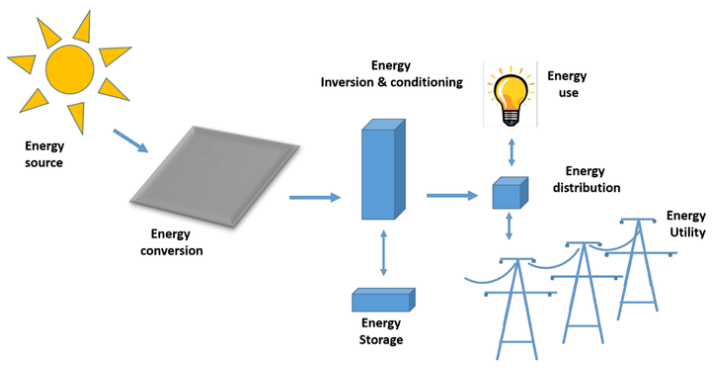

```{r setup, include=FALSE}
#library(RefManageR)
#BibOptions(check.entries = FALSE,
           #bib.style = "authoryear",
           #cite.style = "authoryear",
           #style = "markdown",
           #hyperlink = TRUE,
           #dashed = FALSE,
           #no.print.fields=c("doi", "url", "urldate", "issn"))
#myBib <- ReadBib("references.bib", check = FALSE)
```

```{r xaringan-themer, include=FALSE, warning=FALSE}
library(xaringanthemer)

style_mono_light(
  base_color = "#722f37",
  background_color = "#fafafa",
  header_font_google = google_font("Lato"),
  text_font_google   = google_font("Lato"),
  code_font_google   = google_font("Lato"),
  base_font_size = "20px",
  header_h1_font_size = "2.2rem",
  header_h2_font_size = "1.7rem",
  header_h3_font_size = "1.3rem",
  extra_css = list(
    ".remark-slide-content" = list(
      "font-size" = "20px",
      "line-height" = "1.4"
    ),
    ".title-slide" = list(
      "background-image" = "url('images/barca_skyline_solar.webp')",
      "background-size" = "cover",
      "background-position" = "center",
      "background-repeat" = "no-repeat",
      "color" = "white",
      "text-shadow" = "none"
    ),
    ".title-slide h1" = list(
      "font-size" = "44px",
      "margin-bottom" = "16px",
      "color" = "white",
      "text-shadow" = "none"
    ),
    ".title-slide h2" = list(
      "font-size" = "26px",
      "margin-top" = "0px",
      "margin-bottom" = "24px",
      "color" = "white",
      "text-shadow" = "none"
    ),
    ".title-slide h3" = list(
      "font-size" = "18px",
      "font-weight" = "normal",
      "margin-bottom" = "10px",
      "color" = "white",
      "text-shadow" = "none"
    )
  )
)
```

```{r tech-setup, include=FALSE}

# Panel settings
library(xaringanthemer)
library(xaringanExtra)

options(htmltools.dir.version = FALSE)
# Load xaringanExtra for the tabs
style_extra_css(css = list(
   ".pull-left-wide" = list("float" = "left", "width" = "65%"),
   ".pull-right-narrow" = list("float" = "right", "width" = "30%")
))
xaringanExtra::use_panelset()
```

# Barcelona


---
# What is Photovoltaic Solar Energy?
.pull-left-wide[
```{r, echo=FALSE, out.width='100%', fig.align='right'}
# Add picture

```
<p style="font-size: 0.6em; text-align: center; margin-top: 0;">
Figure 1: Solar Photovoltaic System Diagram (Source: <a href="https://www.researchgate.net/figure/Schematic-diagram-of-the-solar-photovoltaic-systems_fig1_372103821">Dada(2023)</a>)
</p>
]

.pull-right-narrow[
- Allows electricity to be generated from sunlight 
- The electricity generated can be brought onto the electric grid or can be used on site instantly to reduce energy consumption of conventional networks.
- Provide shade and simultaneously uses solar power to generate electricity. 
]

---
# Problems and Issues
Barcelona has major rooftop solar potential, but that potential is not fully utilised due to structural, social, and planning barriers.

1. Low local energy self-sufficiency
  - Barcelona generates very small share of the energy it consumes
  - Renewable energy is still underdeveloped at city and local level

2. Underused potential
  - Extensive flat rooftop
  - Flat roofs provides solar potential
  - Low household adoption

3. Social and building constraints
  - Ageing building stock with poor energy performance
  - Rising household energy bills

4. Governance
  - Lacks a city-scale system to identify where solar and storage should be prioritised for maximising social, economic, and environmental benefit
  - Current installations are largely concentrated in public and municipal spaces

---
# Policy Goals and Agenda

---
# Benefits

---
# Workflow

---
# Project Timeline

---
# References

```{r, echo=FALSE, results='asis'}
#PrintBibliography(myBib)
```
---