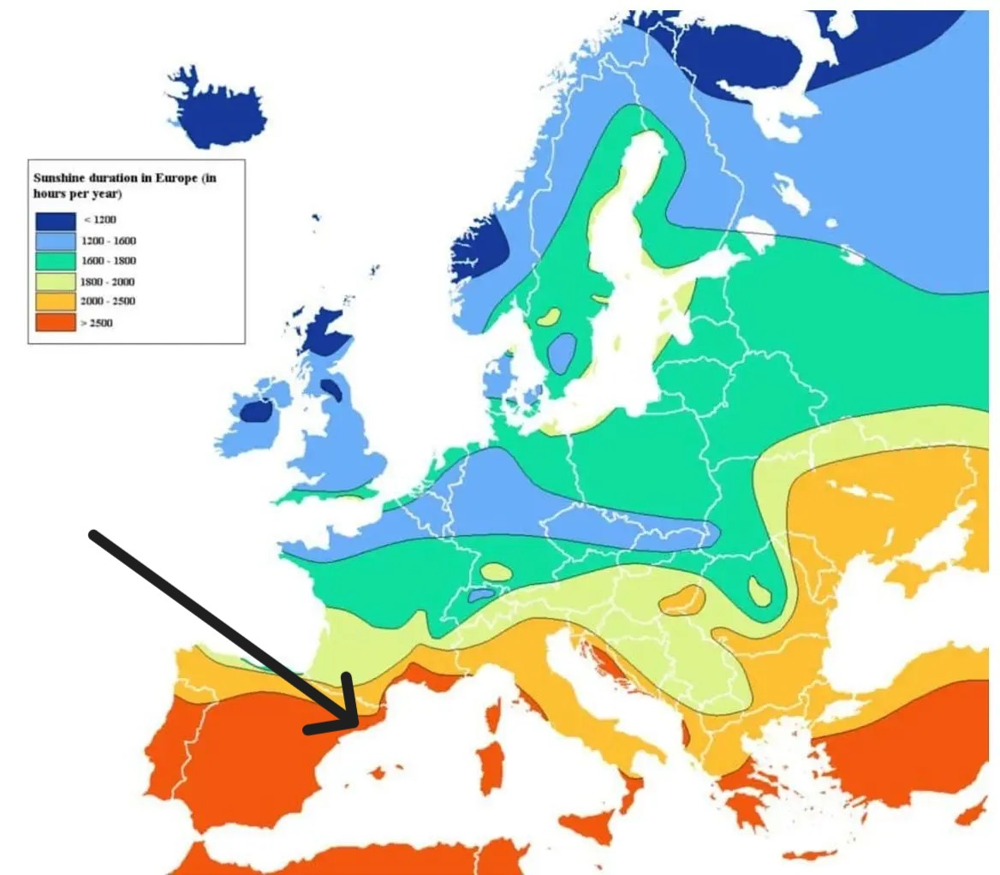
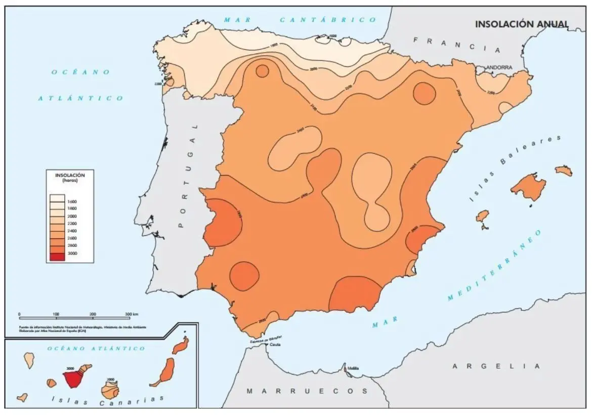

```{r setup, include=FALSE}
#library(RefManageR)
#BibOptions(check.entries = FALSE,
           #bib.style = "authoryear",
           #cite.style = "authoryear",
           #style = "markdown",
           #hyperlink = TRUE,
           #dashed = FALSE,
           #no.print.fields=c("doi", "url", "urldate", "issn"))
#myBib <- ReadBib("references.bib", check = FALSE)
```

```{r xaringan-themer, include=FALSE, warning=FALSE}
library(xaringanthemer)

style_mono_light(
  base_color = "#722f37",
  background_color = "#fafafa",
  header_font_google = google_font("Lato"),
  text_font_google   = google_font("Lato"),
  code_font_google   = google_font("Lato"),
  base_font_size = "20px",
  header_h1_font_size = "2.2rem",
  header_h2_font_size = "1.7rem",
  header_h3_font_size = "1.3rem",
  extra_css = list(
    ".remark-slide-content" = list(
      "font-size" = "20px",
      "line-height" = "1.4"
    ),
    ".title-slide" = list(
      "background-image" = "url('images/barca_skyline_solar.webp')",
      "background-size" = "cover",
      "background-position" = "center",
      "background-repeat" = "no-repeat",
      "color" = "white",
      "text-shadow" = "none"
    ),
    ".title-slide h1" = list(
      "font-size" = "44px",
      "margin-bottom" = "16px",
      "color" = "white",
      "text-shadow" = "none"
    ),
    ".title-slide h2" = list(
      "font-size" = "26px",
      "margin-top" = "0px",
      "margin-bottom" = "24px",
      "color" = "white",
      "text-shadow" = "none"
    ),
    ".title-slide h3" = list(
      "font-size" = "18px",
      "font-weight" = "normal",
      "margin-bottom" = "10px",
      "color" = "white",
      "text-shadow" = "none"
    )
  )
)
```

```{r tech-setup, include=FALSE}

# Panel settings
library(xaringanthemer)
library(xaringanExtra)

options(htmltools.dir.version = FALSE)
# Load xaringanExtra for the tabs
style_extra_css(css = list(
   ".pull-left-wide" = list("float" = "left", "width" = "65%"),
   ".pull-right-narrow" = list("float" = "right", "width" = "30%")
))
xaringanExtra::use_panelset()
```

# Barcelona
.pull-left[
```{r, echo=FALSE, out.width='100%', fig.align='right'}
# Add EU sunshine picture

```
<p style="font-size: 0.6em; text-align: center; margin-top: 0;">
Figure 1: Levels of sunshine across Europe (Source: <a href="https://quierosol.com/en/solar-panels/installation/barcelona">Quiero Sol.(2021)</a>)
</p>
]
.pull-right[
```{r, echo=FALSE, out.width='100%', fig.align='right'}
# Add picture

```
<p style="font-size: 0.6em; text-align: center; margin-top: 0;">
Figure 2: Average Annual Insolation Map (Source: <a href="https://quierosol.com/en/solar-panels/installation/barcelona">Quiero Sol.(2021)</a>)
</p>
]

---
# What is Photovoltaic Solar Energy?
```{r, echo=FALSE, out.width='100%', fig.align='right'}
# Add picture
knitr::include_graphics("images/diagram.png")
```
<p style="font-size: 0.6em; text-align: center; margin-top: 0;">
Figure 3: Solar Photovoltaic System Diagram (Source: <a href="https://solargis.com/technology/expertise#modeling-site-conditions">Solargis.com(2026)</a>)
</p>
- Allows electricity to be generated from sunlight 
- The electricity generated can be brought onto the electric grid or can be used on site instantly to reduce energy consumption of conventional networks.
- Provide shade and simultaneously uses solar power to generate electricity. 

---
# Problems and Issues
Barcelona has major rooftop solar potential, but that potential is not fully utilised due to structural, social, and planning barriers.

1. Low local energy self-sufficiency
  - Barcelona generates very small share of the energy it consumes
  - Renewable energy is still underdeveloped at city and local level

2. Underused potential
  - Extensive flat rooftop
  - Flat roofs provides solar potential
  - Low household adoption

3. Social and building constraints
  - Ageing building stock with poor energy performance
  - Rising household energy bills

4. Governance
  - Lacks a city-scale system to identify where solar and storage should be prioritised for maximising social, economic, and environmental benefit
  - Current installations are largely concentrated in public and municipal spaces

---
# Policy Goals and Agenda

---
# Benefits

---
# Workflow


---
class: inverse, center, middle
# Dashboard Redesign 


---
# Analysis of Barcelona’s Current Solar Dashboard

### 1. *Resource Potential*

  --**Incident Solar Radiation:** Currently provided as a qualitative rating (e.g., "Very Good"). 

  --**Solar Irradiated Surface Area:** The total roof area receiving effective sunlight ($m^2$) 

### 2. *Performance Data*

 --**Effective Usable Area:** Net rooftop area available for PV installation after general setbacks. 

 --**Installable Capacity:** Potential peak power output measured in $kW$. 

 --**Annual Energy Generation:** Estimated yearly electricity production in $kWh/year$ 

 --**Common Area Consumption Coverage:** Indicates that the generation covers more than $100\%$ of the building's shared areas' energy needs. 
 
---


### 3. *Environmental Impact* 

 --**GHG Emissions Savings:** Measured in $kgCO_2eq/year$ to align with SDG 13 (Climate Action). 

### 4. *Economic Assessment* 

 --**Estimated Investment Cost:** Initial capital expenditure ($€$) for the installation. 

 --**Estimated Maintenance Cost:** Yearly operational expenses ($€/year$) 

 --**Estimated Financial Savings:** Annual reduction in electricity bills ($€/year$). 

---
# Formula

### **1.1 Net Solar Potential Gap ($E_{gap}$)**
*Correcting the "Precision Gap" by filtering micro-obstacles and existing stock.*
$$E_{gap} = \left[ (A_{roof} \times f_{obs}) - A_{exist} \right] \times G \times \eta_{sys} \times PR$$
* **$f_{obs}$**: LiDAR-derived Obstacle Factor (Usable Area / Total Area).
* **$A_{exist}$**: RS-detected existing PV area.
* **$PR$**: Performance Ratio (Correction for temperature and system losses).


### **1.2 Tilt & Azimuth Gain ($G_{eff}$)**
*Correcting irradiation based on 3D geometry from LiDAR point clouds.*
$$G_{eff} = G \times \frac{\cos(i)}{\cos(z)}$$
* **$i$**: Incidence angle (angle between the roof's normal vector and the sun).

---

### **1.3 Solar Gap Score ($Score_{gap}$)**
*Ranking rooftops for strategic development.*
$$Score_{gap} = \frac{E_{gap}}{E_{max\_cadastre}} \times \text{Confidence\_Score}$$


### **1.4 Social Equity Index ($SEI$)**
*Weighting potential by socio-economic vulnerability.*
$$SEI = \text{Norm}(Score_{gap}) \times \omega_{poverty}$$


### **1.5 Self-Sufficiency Ratio ($SSR_{live}$)**
*Real-time resilience monitoring for public building pilots.*
$$SSR_{live} = \frac{\min(P_{gen}, P_{load})}{P_{load}}$$

---

## 2. API Field Specification (Table)

| Category | Field Name | Description | Value / Source | Data Type | Range / Unit |
| :--- | :--- | :--- | :--- | :--- | :--- |
| **Metadata** | `Global_ID` | National parcel code for cadastre sync. | Spanish Cadastre | String | Unique ID |
| | `Confidence_Score`| AI detection reliability rating. | RS Model Output | Float | 0.00 - 1.00 |
| **Spatial** | `PV_Area_Detected` | Area of existing solar panels. | VHR Satellite | Float | $\ge 0$ $m^2$ |
| | `Effective_Potential`| Net usable area for new panels. | LiDAR Point Cloud | Float | $\ge 0$ $m^2$ |
| | `Obstacle_Ratio` | Ratio of roof blocked by obstacles. | LiDAR Analysis | Float | 0.00 - 1.00 |
| **Technical** | `Average_Tilt` | Slope derived from 3D point cloud. | LiDAR Geometry | Float | 0.0 - 90.0 $^\circ$ |
| | `Azimuth` | Orientation (180° = True South). | LiDAR Geometry | Integer | 0 - 359 $^\circ$ |
| | `Solar_Hours` | Annual sun hours (3D shading applied).| Ray-tracing | Integer | 0 - 8760 h |
| **Attributes**| `Roof_Material` | Surface material (e.g., Tile, Metal). | RS Spectral | Enum | [Material] |
| | `Land_Use_Class` | Functional use (Million-AID classes). | RS/GIS | Enum | [Class] |
| **Impact** | `Solar_Gap_Score` | Priority index for deployment. | Plugin Analytics | Float | 0.00 - 1.00 |
| | `Social_Equity_Index`| Subsidization priority indicator. | Census + RS | Enum | [Low-High] |
| | `CO2_Offset_Annual` | Estimated carbon reduction potential. | Performance Model | Float | $kgCO_2eq/y$ |
| | `Economic_ROI` | Dynamic return on investment period. | Financial Model | Float | Years |

---


## 3. Full API Schema (JSON)

```json
{
  "Metadata": {
    "Building_ID": "BCN_EIX_12345",
    "Global_ID": "ES.CAT.BCN.4567890",
    "Last_Updated": "2024-05-20T10:30:00Z",
    "Data_Confidence_Score": 0.95
  },

  "Spatial_Geometry_EO": {
    "Total_Roof_Area": 250.5,
    "PV_Detected_Area": 45.0,
    "Effective_Potential_Area": 120.5,
    "Obstacle_Metrics": {
      "Obstacle_Area": 37.5,
      "Obstacle_Ratio": 0.15,
      "Major_Obstacles": ["HVAC_Units", "Chimneys", "Parapet_Walls"]
    },
    "Technical_Specs": {
      "Average_Tilt": 15.5,
      "Azimuth_Orientation": 180,
      "Solar_Hours_Annual": 1650
    }
  },

  "Urban_Context_Attributes": {
    "Roof_Classification": {
      "Type": "Flat",
      "Material": "Concrete",
      "Is_Green_Roof": false
    },
    "Planning_Constraints": {
      "Land_Use_Class": "Municipal",
      "Heritage_Status": 0,
      "District_Zoning": "Eixample_Conservation_Area"
    }
  },

  "Energy_Performance_Monitoring": {
    "Installed_System": {
      "Estimated_Capacity_kWp": 9.0,
      "Installation_Age_Category": "3-5_Years",
      "Performance_Ratio_Est": 0.82
    },
    "Live_Flow_Pilot": {
      "Current_Generation_kW": 12.5,
      "Current_Building_Load_kW": 8.2,
      "Self_Sufficiency_Ratio": 0.65,
      "Grid_Export_kW": 4.3
    }
  },

  "Policy_Impact_Indicators": {
    "Solar_Gap_Score": 0.88,
    "Social_Equity_Index": "High_Priority",
    "Estimated_CO2_Offset_Annual": 4373.7,
    "Economic_ROI_Years": 6.5
  }
}
```

---
# Project Timeline

---
# References

```{r, echo=FALSE, results='asis'}
#PrintBibliography(myBib)
```
---