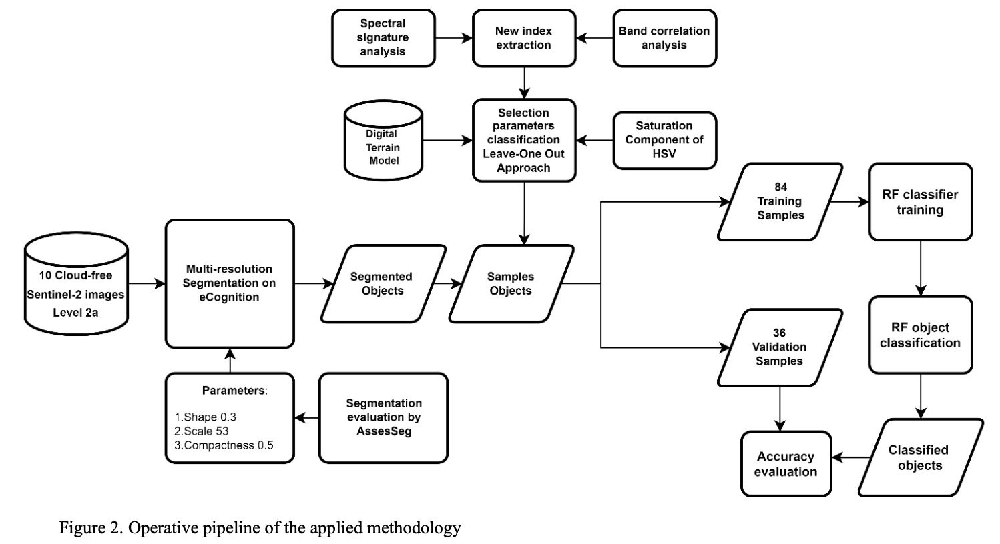
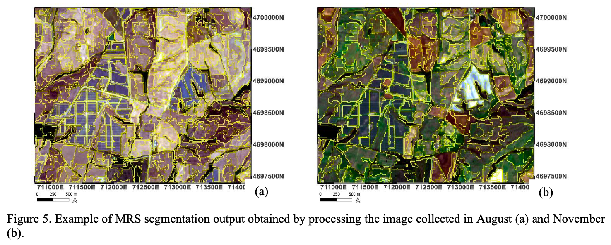
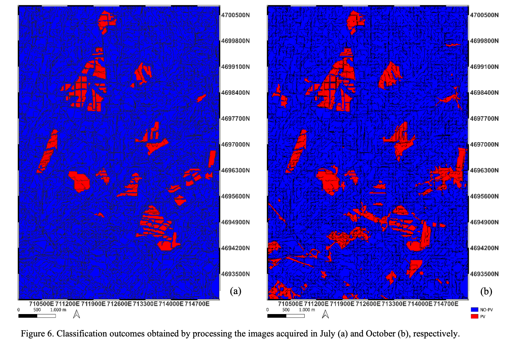
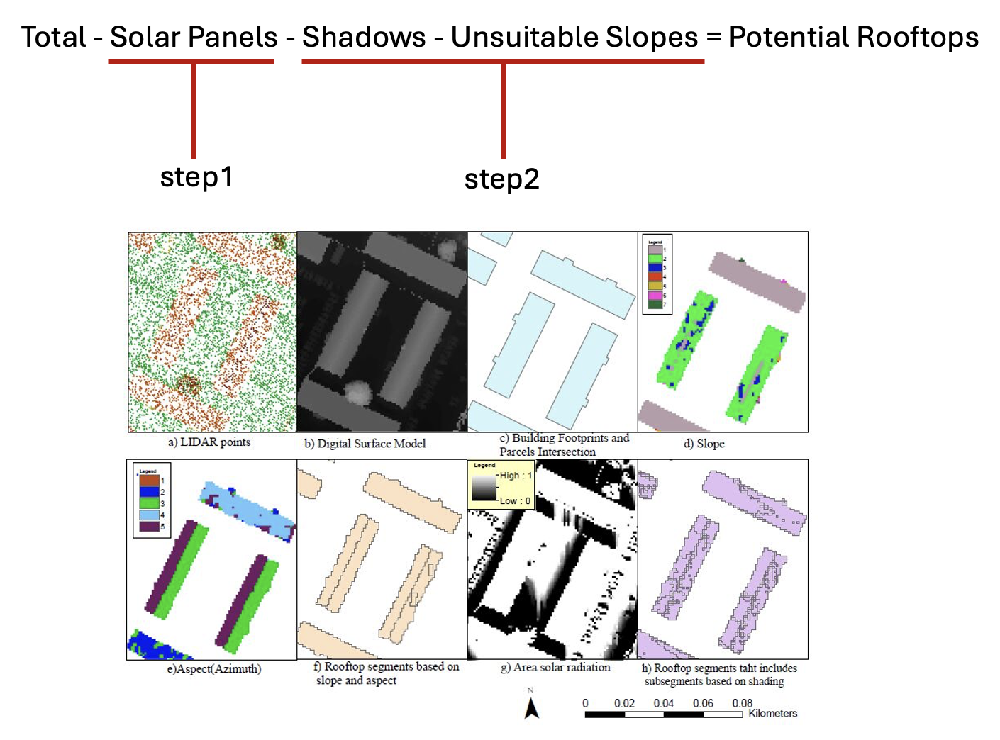
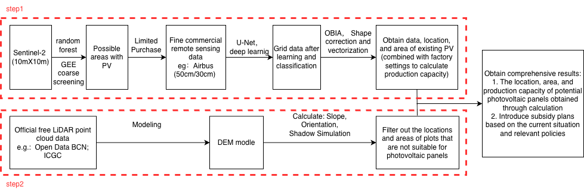

```{r setup, include=FALSE}
#library(RefManageR)
#BibOptions(check.entries = FALSE,
           #bib.style = "authoryear",
           #cite.style = "authoryear",
           #style = "markdown",
           #hyperlink = TRUE,
           #dashed = FALSE,
           #no.print.fields=c("doi", "url", "urldate", "issn"))
#myBib <- ReadBib("references.bib", check = FALSE)
```

```{r xaringan-themer, include=FALSE, warning=FALSE}
library(xaringanthemer)

style_mono_light(
  base_color = "#722f37",
  background_color = "#fafafa",
  header_font_google = google_font("Lato"),
  text_font_google   = google_font("Lato"),
  code_font_google   = google_font("Lato"),
  base_font_size = "20px",
  header_h1_font_size = "2.2rem",
  header_h2_font_size = "1.7rem",
  header_h3_font_size = "1.3rem",
  extra_css = list(
    ".remark-slide-content" = list(
      "font-size" = "20px",
      "line-height" = "1.4"
    ),
    ".title-slide" = list(
      "background-image" = "url('images/barca_skyline_solar.webp')",
      "background-size" = "cover",
      "background-position" = "center",
      "background-repeat" = "no-repeat",
      "color" = "white",
      "text-shadow" = "none"
    ),
    ".title-slide h1" = list(
      "font-size" = "44px",
      "margin-bottom" = "16px",
      "color" = "white",
      "text-shadow" = "none"
    ),
    ".title-slide h2" = list(
      "font-size" = "26px",
      "margin-top" = "0px",
      "margin-bottom" = "24px",
      "color" = "white",
      "text-shadow" = "none"
    ),
    ".title-slide h3" = list(
      "font-size" = "18px",
      "font-weight" = "normal",
      "margin-bottom" = "10px",
      "color" = "white",
      "text-shadow" = "none"
    )
  )
)
```

```{r tech-setup, include=FALSE}

# Panel settings
library(xaringanthemer)
library(xaringanExtra)

options(htmltools.dir.version = FALSE)
# Load xaringanExtra for the tabs
style_extra_css(css = list(
   # pull left wide and right narrow
   ".pull-left-wide" = list("float" = "left", "width" = "60%"),
   ".pull-right-narrow" = list("float" = "right", "width" = "35%"),
   # 3 columns
   ".pull-left-3" = list("float" = "left", "width" = "30%"),
   ".pull-middle-3" = list("float" = "left", "width" = "30%", "margin-left" = "5%", "margin-right" = "5%"),
   ".pull-right-3" = list("float" = "right", "width" = "30%")
))
xaringanExtra::use_panelset()
```
# Barcelona
### High Solar Potential, Low Energy Self-sufficiency
.pull-left-wide[
- **Ideal conditions**: High solar exposure, dense flat roofscape, existing policy commitments
- **Potential**: 7.9M m² suitable roof area, generation potential of 1,191 GWh/year around 60% of domestic electricity demand
- **Low realisation**: City produces just 1% of its own energy, only 5% of households have solar installations in 2022
- **Core Issue**: High location and technical potential, but low deployment
- **Why**: Barcelona faces pressure on resilience, affordability and decarbonisation
]
.pull-right-narrow[
```{r, echo=FALSE, out.width='80%', fig.align='center'}
# Add EU sunshine picture
knitr::include_graphics("images/eu_sunshine_arrow.jpg")
```
<p style="font-size: 0.6em; text-align: center; margin-top: 0;">
Figure 1: Levels of sunshine across Europe (Source: <a href="https://quierosol.com/en/solar-panels/installation/barcelona">Quiero Sol.(2021)</a>)
</p>
```{r, echo=FALSE, out.width='80%', fig.align='center'}
# Add picture
knitr::include_graphics("images/solar_panels_barca.webp")
```
<p style="font-size: 0.6em; text-align: center; margin-top: 0;">
Figure 2: Solar Panels (Source: <a href="https://www.theguardian.com/world/2022/jul/24/barcelona-school-residents-create-solar-energy-community">the Guardian (2022)</a>)
</p>
]
---
# Key Problems and Issues
Barcelona has high rooftop solar potential, but remains undeveloped at local and regional scale...
.panelset[
.panel[.panel-name[Low Local Energy Self-Sufficiency]
- Barcelona produces approximately 1% of the energy it consumes on its territory

- Only 5% of households have solar energy installations

- Renewable energy generation remains underdeveloped at both local and regional scale

<p style="font-size: 0.6em; text-align: left; margin-top: 0;">
Source: <a href="https://bcnroc.ajuntament.barcelona.cat/jspui/bitstream/11703/134731/2/Climate%20City%20Contracte%20of%20Barcelona%20%28Annexes%29.pdf">Ajuntament de Barcelona(n.d.)</a>
</p>
]

.panel[.panel-name[Under Utilised Rooftop Potential]
- 7.9 million m² of available roof area

- Potential to generate 1,191 GWh/year (approximately ~60% of domestic electricity consumption)

- Flat and slightly inclined terraces account for 67% of total roof surface

- Current installations are concentrated in public and municipal buildings

<p style="font-size: 0.6em; text-align: left; margin-top: 0;">
Source: <a href="https://www.energia.barcelona/en/generate-energy/generar-energia/map-how-much-energy-can-you-generate">Barcelona Energia(n.d.)</a>
</p>
]

.panel[.panel-name[Social and Building Constraints]
- 81% of properties have a low energy performance rating (E, F, or G)

- Ageing housing stock: most residential buildings predate modern energy efficiency standards

- Energy poverty, energy bills account for over 10% of household income for many Barcelona residents

- Low-income households in poorer neighborhoods are least likely to invest in solar installation, compounding spatial inequality

<p style="font-size: 0.6em; text-align: left; margin-top: 0;">
Source: <a href="https://ajuntament.barcelona.cat/barcelonallibres/en/noticia/ageing-housing-with-poor-energy-efficiency-but-a-huge-potential-for-improvement-1188771">Ajuntament de Barcelona(n.d.)</a>
</p>
]
]

---
# Policy Goals and Agenda
.panelset[
.panel[.panel-name[Global Agenda]

.pull-left-3[
```{r, echo=FALSE, out.width='100%', fig.align='right'}
# Add picture
knitr::include_graphics("images/sdg7.jpg")
```
<p style="font-size: 0.6em; text-align: center; margin-top: 0;">
Figure 4: SDG 7: increases access to affordable, reliable and clean energy; Source: <a href="https://www.un.org/sustainabledevelopment/news/communications-material/">United Nations(2024)</a>
</p>
]
.pull-middle-3[
```{r, echo=FALSE, out.width='100%', fig.align='right'}
# Add picture
knitr::include_graphics("images/sdg11.jpg")
```
<p style="font-size: 0.6em; text-align: center; margin-top: 0;">
Figure 5: SDG 11: supports a more sustainable and resilient urban system; Source: <a href="https://www.un.org/sustainabledevelopment/news/communications-material/">United Nations(2024)</a>
</p>
]
.pull-right-3[
```{r, echo=FALSE, out.width='100%', fig.align='right'}
# Add picture
knitr::include_graphics("images/sdg13.jpg")
```
<p style="font-size: 0.6em; text-align: center; margin-top: 0;">
Figure 6: SDG 13: reduces emissions and strengthens climate action in the built environment; Source: <a href="https://www.un.org/sustainabledevelopment/news/communications-material/">United Nations(2024)</a>
</p>
]
]
.panel[.panel-name[EU Policy]
- **The European Green Deal, Renewable Energy Directive**
  - Binding target of 42.5% renewable energy across the EU by 2030
  
- **EU Solar Energy Strategy**
  - Target of 600 GW of solar PV capacity across the EU by 2030
  
- **Renovation Wave Strategy**
  - Target to renovate 35 million buildings by 2030 (including improving energy performance)

<p style="font-size: 0.6em; text-align: left; margin-top: 0;">
Source: <a href="https://energy.ec.europa.eu/topics/renewable-energy/renewable-energy-directive-targets-and-rules/renewable-energy-directive_en">Energy(2023)</a>, <a href="https://energy.ec.europa.eu/topics/energy-efficiency/energy-performance-buildings/renovation-wave_en#:~:text=Renovating%20both%20public%20and%20private,to%20regional%20and%20local%20actors 
">Energy(2020)</a>, <a href="https://energy.ec.europa.eu/topics/energy-efficiency/energy-performance-buildings/renovation-wave_en#:~:text=Renovating%20both%20public%20and%20private,to%20regional%20and%20local%20actors 
">European Parliament(2024)</a>
</p>

]

.panel[.panel-name[National Policy]
- Integrated National Energy and Climate Plan (NECP) 2023-2030

  - Targets 81 % renewable energy in electricity generation and 48 % renewables on final energy use by 2030
  
  - Installation of 76 GW of photovoltaics (with 19 GW for self-consumption) by 2030
  
  - Lower household energy expenditure to 5.7% by 2030

<p style="font-size: 0.6em; text-align: left; margin-top: 0;">
Source: <a href="https://www.miteco.gob.es/es/prensa/ultimas-noticias/2024/septiembre/el-gobierno-aprueba-la-actualizacion-del-plan-nacional-integrado.html">Ministerio para la Transición Ecológica y el Reto Demográfico. (2023)</a>
</p>
]

.panel[.panel-name[Municipal Policy]
Barcelona 2030 Agenda localises SDGs into city scale targets and indicators as a municipal framework. Key policy objectives includes the Barcelona Climate Plan and Strategy for Energy Transition. 
.pull-left-wide[
**Barcelona Climate Plan 2018-2030**
.pull-left-3[
```{r, echo=FALSE, out.width='100%', fig.align='right'}
# Add picture
knitr::include_graphics("images/bcp5.png")
```
<p style="font-size: 0.4em; text-align: center; margin-top: 0;">
Figure 7:Line of Action 5, recover terrace roofs and increase PV generation; Source: <a href="https://www.barcelona.cat/barcelona-pel-clima/sites/default/files/climate_plan_maig.pdf">Ajuntament de Barcelona(2018)</a>
</p>
]
.pull-middle-3[
```{r, echo=FALSE, out.width='100%', fig.align='right'}
# Add picture
knitr::include_graphics("images/bcp9.png")
```
<p style="font-size: 0.4em; text-align: center; margin-top: 0;">
Figure 8: Line of Action 9, renewables in public space and municipal deployment; Source: <a href="https://www.barcelona.cat/barcelona-pel-clima/sites/default/files/climate_plan_maig.pdf">Ajuntament de Barcelona(2018)</a>
</p>
]
.pull-right-3[
```{r, echo=FALSE, out.width='100%', fig.align='right'}
# Add picture
knitr::include_graphics("images/bcp12.png")
```
<p style="font-size: 0.4em; text-align: center; margin-top: 0;">
Figure 9: Line of Action 12,green jobs, self-employment and climate-related economic transition; Source: <a href="https://www.barcelona.cat/barcelona-pel-clima/sites/default/files/climate_plan_maig.pdf">Ajuntament de Barcelona(2018)</a>
</p>
]
]
.pull-right-narrow[
**Strategy for Energy Transition**

Increasing electricity generation by 10% with renewables across city, increase PV capacity fivefold,support energy refurbishment, promote and financially support installations
<p style="font-size: 0.4em; text-align: left; margin-top: 0;">
Source: <a href="https://ajuntament.barcelona.cat/ecologiaurbana/en/what-we-do-and-why/energy-and-climate-change/strategy-energy-transition">Ajuntament de Barcelona(n.d.)</a>, <a href="https://www.barcelona.cat/barcelona-pel-clima/en/pla-clima/pla-transicio-energetica">Barcelona for Climate(2025)</a>
</p>
]
]
.panel[.panel-name[Municipal Incentives]
Tax Incentives
- The Barcelona City Council offers tax incentives for solar installations

  - Up to 50% reduction on property tax (IBI) for first 3 years after installation
  
  - 95% reduction on construction and installation works tax (ICIO)
  
  - 50% reduction on business activity tax (IAE) for related economic activities

<p style="font-size: 0.4em; text-align: left; margin-top: 0;">
Source: <a href="https://www.energia.barcelona/en/generate-energy/generate-energy/grants-and-allowances">Barcelona Energia(n.d.)</a>
</p>
]
]

---
class: inverse, center, middle
#What is missing?
### Barcelona has a strong policy commitment, but lack of a city-scale operational system to identify where rooftop solar should be prioritised to maximum social, economic, and environmental benefit!


---
class: inverse, center, middle
## Analysis of Barcelona’s Current Solar Dashboard

--
Do you want to know how much energy you can generate in your home? 

Search for your building and discover its energy potential:
---

```{css, echo=FALSE}
/* 7-3 ratio */
.left-70 { width: 63%; float: left; }
.right-30 { width: 34%; float: right; }

/* slider panel */
.scroll-box {
  height: 400px;
  overflow-y: auto;
  padding: 6px;
  border-left: 1px solid #802222;
}
/* 优化 Markdown 列表在 div 中的显示 */
.scroll-box ul { display: block; }
```

## Analysis of Barcelona’s Current Solar Dashboard


.left-70[
### .center[Dashboard Overview]


.footnote[Source: [Barcelona Energia Mapa](https://www.energia.barcelona/ca/generar-energia/generar-energia/mapa-quanta-energia-podeu-generar)]
]

.right-30[
### .center[Key Metrics]

.scroll-box[
#### 📊 Resource Potential
- **Radiation:** Qualitative rating  
######***(e.g., "Very Good")***

- **Surface Area:** Total roof area ($m^2$)

#### ⚡ Performance Data
- **Usable Area:** Net area
- **Capacity:** Peak power ($kW$)
- **Generation:** $kWh/year$
- **Coverage:** $>100\%$ needs

#### 🌍 Environmental Impact
- **GHG Savings:** $kgCO_2eq/year$

#### 💰 Economic Assessment
- **Investment:** CapEx (€)
- **Maintenance:** €/year
- **Financial Savings:** €/year
]
]

---
class: inverse, center, middle
# Research Question: GAP

--
### The "Static" Gap: 
Current data provides a "snapshot" of theoretical potential but cannot monitor the actual progress of solar installations in real-time. (Without knowing what is already "on the roof," the city cannot track its progress toward Global Development Goals (e.g., SDG 7).) 
--

### The "Precision" Gap: 
Small obstacles (chimneys, HVAC) are often ignored, leading to a 20% overestimation of usable area. (resulting in unrealistic financial expectations for citizens and flawed energy planning for the city.) 
--

### The "Integration" Gap:  
Auto-Syncing API - Open Data 


???
# Analysis of Barcelona’s Current Solar Dashboard

### 1. *Resource Potential*

  --**Incident Solar Radiation:** Currently provided as a qualitative rating (e.g., "Very Good"). 

  --**Solar Irradiated Surface Area:** The total roof area receiving effective sunlight ($m^2$) 

### 2. *Performance Data*

 --**Effective Usable Area:** Net rooftop area available for PV installation after general setbacks. 

 --**Installable Capacity:** Potential peak power output measured in $kW$. 

 --**Annual Energy Generation:** Estimated yearly electricity production in $kWh/year$ 

 --**Common Area Consumption Coverage:** Indicates that the generation covers more than $100\%$ of the building's shared areas' energy needs. 

### 3. *Environmental Impact* 

 --**GHG Emissions Savings:** Measured in $kgCO_2eq/year$ to align with SDG 13 (Climate Action). 

### 4. *Economic Assessment* 

 --**Estimated Investment Cost:** Initial capital expenditure ($€$) for the installation. 

 --**Estimated Maintenance Cost:** Yearly operational expenses ($€/year$) 

 --**Estimated Financial Savings:** Annual reduction in electricity bills ($€/year$). 


---
# Methodology - Step1: U-net
.pull-left[
**5. End-to-End Extraction** 
        --Enables automated identification of PV arrays within complex urban environments without manual intervention.
        
**6. Interference Robustness**
        --Effectively distinguishes PV panels from spectrally similar distractors, such as dark rooftops, glass facades, and shadows.
        
**7. High IoU Performance**
        --Demonstrates superior Intersection over Union (IoU) metrics, showing high congruence with ground-truth annotations.
        
**8. Data Implementation** 
        -- Integrated with OBIA post-processing to generate policy-ready Shapefile vector databases for governmental decision-making.
        
]

.pull-right[
```{r, echo=FALSE, out.width='100%', fig.align='center'}
# Add picture
knitr::include_graphics("images/U-net1.png")
```
<p style="font-size: 0.6em; text-align: center; margin-top: 0;">
Figure: Results of U-net model (Source: <a href="https://www.mdpi.com/2076-3417/11/14/6524"> Pérez-González et.al.,(2021) </a>) 
</p>
]

---
# Methodology - Step 1: U-net
**5. End-to-End Extraction** 
  - Enables automated identification of PV arrays within complex urban environments without manual intervention.
        
**6. Interference Robustness**
  - Effectively distinguishes PV panels from spectrally similar distractors, such as dark rooftops, glass facades, and shadows.
        
**7. High IoU Performance**
  - Demonstrates superior Intersection over Union (IoU) metrics, showing high congruence with ground-truth annotations.
        
**8. Data Implementation** 
  - Integrated with OBIA post-processing to generate policy-ready Shapefile vector databases for governmental decision-making.


---
# Methodology - Step 1: U-net
```{r, echo=FALSE, out.width='100%', fig.align='center'}
# Add picture
knitr::include_graphics("images/U-net1.png")
```
<p style="font-size: 0.6em; text-align: center; margin-top: 0;">
Figure: Results of U-net model (Source: <a href="https://www.mdpi.com/2076-3417/11/14/6524"> Pérez-González et.al.,(2021) </a>) 
</p>

---
# Methodology - Step 1: OBIA
**1. Multiresolution Segmentation** 
  - Aggregates spectrally similar pixels into geographically meaningful objects to mitigate "salt-and-pepper" noise.
        
**2. Geometric Constraints**
  - Leverages physical attributes—including aspect ratio, rectangularity, and area—to filter out non-PV entities (e.g., circular water tanks).
        
**3. Spectral-Spatial Integration**
  - Evaluates object regularity alongside spectral signatures to significantly reduce false-positive rates.
        
**4. Vectorized Output** 
  - Facilitates the direct export of GIS-compliant polygonal boundaries, streamlining precise surface area calculations.

---
# Methodology- Step 1: OBIA
```{r, echo=FALSE, out.width='100%', fig.align='center'}
# Add picture

```
<p style="font-size: 0.6em; text-align: center; margin-top: 0;">
Figure: Workflow of OBIA model (Source: <a href="https://www.spiedigitallibrary.org/conference-proceedings-of-spie/12262/122620K/Combining-OBIA-approach-and-machine-learning-algorithm-to-extract-photovoltaic/10.1117/12.2636451.full?tab=ArticleLinkCited"> Ladisa et.al.,(2022) </a>)
</p>

---
# Methodology - Step 1: OBIA
```{r, echo=FALSE, out.width='100%', fig.align='center'}
# Add picture

```
<p style="font-size: 0.6em; text-align: center; margin-top: 0;">
Figure: Process of OBIA model (Source: <a href="https://www.spiedigitallibrary.org/conference-proceedings-of-spie/12262/122620K/Combining-OBIA-approach-and-machine-learning-algorithm-to-extract-photovoltaic/10.1117/12.2636451.full?tab=ArticleLinkCited"> Ladisa et.al.,(2022) </a>)
</p>

---
# Methodology - Step 1: OBIA
```{r, echo=FALSE, out.width='90%', fig.align='center'}
# Add picture

```
<p style="font-size: 0.6em; text-align: center; margin-top: 0;">
Figure: Results of OBIA model (Source: <a href="https://www.spiedigitallibrary.org/conference-proceedings-of-spie/12262/122620K/Combining-OBIA-approach-and-machine-learning-algorithm-to-extract-photovoltaic/10.1117/12.2636451.full?tab=ArticleLinkCited"> Ladisa et.al.,(2022) </a>)
</p>

---
# Step2- Lidar Workflow
```{r, echo=FALSE, out.width='90%', fig.align='center'}
# Add picture
knitr::include_graphics("images/lidar1.png")
```
<p style="font-size: 0.6em; text-align: center; margin-top: 0;">
Figure: Results of OBIA model (Source: <a href="https://www.spiedigitallibrary.org/conference-proceedings-of-spie/12262/122620K/Combining-OBIA-approach-and-machine-learning-algorithm-to-extract-photovoltaic/10.1117/12.2636451.full?tab=ArticleLinkCited"> Ladisa et.al.,(2022) </a>)
</p>


---
# Step2-Solar Radiation
```{r, echo=FALSE, out.width='90%', fig.align='center'}
# Add picture
knitr::include_graphics("images/lidar2.png")
```
<p style="font-size: 0.6em; text-align: center; margin-top: 0;">
Figure: Results of OBIA model (Source: <a href="https://www.spiedigitallibrary.org/conference-proceedings-of-spie/12262/122620K/Combining-OBIA-approach-and-machine-learning-algorithm-to-extract-photovoltaic/10.1117/12.2636451.full?tab=ArticleLinkCited"> Ladisa et.al.,(2022) </a>)
</p>

---

```{r, echo=FALSE, out.width='90%', fig.align='center'}
# Add picture

```
<p style="font-size: 0.6em; text-align: center; margin-top: 0;">
Figure: Results of OBIA model (Source: <a href="https://www.spiedigitallibrary.org/conference-proceedings-of-spie/12262/122620K/Combining-OBIA-approach-and-machine-learning-algorithm-to-extract-photovoltaic/10.1117/12.2636451.full?tab=ArticleLinkCited"> Ladisa et.al.,(2022) </a>)
</p>


---
class: reverse, center, middle
# Dashboard Redesign   

--
### Static---Dynamic  

--
### Theoretical---Practical  

--
### Isolated---Intergrated  
 
???
"While Barcelona’s current dashboard relies on static geometric estimations (e.g., gross rooftop area), our Smart Plugin integrates VHR (Very High Resolution) imagery and LiDAR point clouds. By deploying Deep Learning segmentation, we verify 'true availability' by filtering out micro-obstacles (HVAC, chimneys) and existing PV panels, thereby providing a high-fidelity mapping of the Net Potential Expansion Area."

---

## **Step A：Deep Learning_Existing Asset Detection  **
```{css, echo=FALSE}
/* 布局控制 */
.left-70 { width: 68%; float: left; }
.right-30 { width: 30%; float: right; height: 500px; overflow-y: auto; }

/* 图片框容器 */
.img-viewer {
  width: 100%; height: 380px; 
  border: 1px solid #ddd; overflow: hidden;
  display: flex; align-items: center; justify-content: center;
  background: #f8f8f8; position: relative;
}
.img-viewer img { max-width: 100%; transition: transform 0.3s; transform-origin: center; }

/* 按钮与折叠面板 */
.nav-btns { margin-top: 10px; text-align: center; }
.nav-btns button { font-size: 12px; margin: 2px; cursor: pointer; }

details { 
  margin-bottom: 10px; padding: 8px;
  background: #f9f9f9; border-left: 3px solid #802222; 
}
summary { font-weight: bold; cursor: pointer; color: #802222; }
```

.left-70[
### .center[Interactive Map Layers]

<div class="img-viewer">
  
</div>

<div class="nav-btns">
  **Layers:** <button onclick="updateSlide('images/01StatusLayerML.png', 'Layer 1: Input Status')">01</button>
  <button onclick="updateSlide('images/02StatusLayerMLOutcome.png', 'Layer 2: ML Segmentation')">02</button>
  <button onclick="updateSlide('images/023StatusLayerMLOutcome.png', 'Layer 3: Final Output')">03</button>
  <br>
  **Tools:** <button onclick="doZoom(1.2)">➕ Zoom In</button>
  <button onclick="doZoom(0.8)">➖ Zoom Out</button>
  <button onclick="doReset()">🔄 Reset</button>
</div>

<p id="layer-caption" style="text-align:center; font-size:0.8em; color:#666;">Current: Layer 1: Input Status</p>
]

.right-30[
### .center[System Specs]

<details open>
  <summary>🔍 Asset Detection</summary>
  - **Existing PV Area:** `PV_Area_Detected` (m^2)
  - Footprint extracted via **Mask2Former**.
</details>

<details>
  <summary>⚡ Capacity Info</summary>
  - **Current Capacity:** `Installed_Capacity` (kWp)
  - Statistical certainty score provided.
</details>

<details>
  <summary>📊 Meta Data</summary>
  - **Confidence:** 0.95
  - **Updated:** 2024-05-20
</details>
]

<script>
let currentScale = 1;
const imgElem = document.getElementById('target-img');
const captionElem = document.getElementById('layer-caption');

function updateSlide(path, text) {
  imgElem.src = path;
  captionElem.innerHTML = "Current: " + text;
  doReset();
}

function doZoom(factor) {
  currentScale *= factor;
  imgElem.style.transform = "scale(" + currentScale + ")";
}

function doReset() {
  currentScale = 1;
  imgElem.style.transform = "scale(1)";
}
</script>


---

## **Step B：LiDAR_Precision Refinement**

```{css, echo=FALSE}
/* 保持与上一页一致的 7-3 比例 */
.left-70 { width: 63%; float: left; }
.right-30 { width: 34%; float: right; }

/* 滚动面板设置 */
.scroll-box-lidar {
  height: 420px;
  overflow-y: auto;
  padding: 10px;
  border-left: 1px solid #2980b9; /* 换成 LiDAR 蓝 */
  background: rgba(240, 248, 255, 0.3);
}

/* 图片查看器容器 */
.img-container {
  width: 100%;
  height: 340px;
  background: #f0f0f0;
  display: flex;
  align-items: center;
  justify-content: center;
  overflow: hidden;
  border-radius: 4px;
}

.nav-btns-lidar {
  display: grid;
  grid-template-columns: repeat(3, 1fr);
  gap: 5px;
  margin-top: 10px;
}

.nav-btns-lidar button {
  font-size: 11px;
  padding: 5px;
  cursor: pointer;
  border: 1px solid #2980b9;
  background: white;
}

.active-lidar { background: #2980b9 !important; color: white; }
```


.left-70[
### .center[LiDAR Precise Positioning]

<div class="img-container">
  
</div>

<div class="nav-btns-lidar">
  <button class="active-lidar" onclick="swapL('images/032Shadeeve.png', 'Evening Shade', this)">🌆 Evening</button>
  <button onclick="swapL('images/03ShadeMor.png', 'Morning Shade', this)">🌅 Morning</button>
  <button onclick="swapL('images/031Shadenoon.png', 'Noon Shade', this)">☀️ Noon</button>
  <button onclick="swapL('images/04Slope.png', 'Slope Analysis', this)">📐 Slope</button>
  <button onclick="swapL('images/05Aspect.png', 'Aspect/Orientation', this)">🧭 Aspect</button>
  <button onclick="swapL('images/06Elevation.png', 'Elevation', this)">⛰️ Elevation</button>
</div>

<p id="lidar-caption" style="text-align:center; font-size:0.8em; color:#2980b9; margin-top:5px;">Layer: 032Shadeeve.png</p>
]

.right-30[
### .center[Key Metrics]

.scroll-box-lidar[

#### 📐 LiDAR Analysis
- **Average_Tilt:** $0.0 - 90.0^\circ$
  - *Normal vector estimation*
- **Azimuth:** $0 - 359^\circ$
  - *180° = True South*

#### ☀️ Effective Potential
- **Solar_Hours:** $0 - 8,760$ (h)
  - *Dynamic ray-tracing*
- **Obstacle_Ratio:** $0.00 - 1.00$
  - *HVAC/Chimney detection*
- **Net Area:** $\ge 0$ ($m^2$)
  - *Voxel-based filtering*

#### 📝 Technical Notes
- **LiDAR:** 10cm+ vertical rooftop appurtenances detection.
- **Shadows:** 3D shadow casting from neighbors.
]
]

<script>
function swapL(path, name, btn) {
  document.getElementById('lidar-display').src = path;
  document.getElementById('lidar-caption').innerText = "Layer: " + path.split('/').pop();
  document.querySelectorAll('.nav-btns-lidar button').forEach(b => b.classList.remove('active-lidar'));
  btn.classList.add('active-lidar');
}
</script>

<div style="clear: both;"></div>


---
## ** Syn API__Expansion Potential **

```{css, echo=FALSE}
/* 维持一致的 7-3 比例 */
.left-70 { width: 63%; float: left; }
.right-30 { width: 34%; float: right; }

/* 滚动面板设置 - 绿色系适配 API/生态数据 */
.scroll-box-api {
  height: 420px;
  overflow-y: auto;
  padding: 10px;
  border-left: 1px solid #27ae60; 
  background: rgba(232, 245, 233, 0.3);
}

/* 图片查看器 */
.img-container-api {
  width: 100%;
  height: 340px;
  background: #f0f0f0;
  display: flex;
  align-items: center;
  justify-content: center;
  overflow: hidden;
  border-radius: 4px;
}

.nav-btns-api {
  display: grid;
  grid-template-columns: repeat(4, 1fr);
  gap: 5px;
  margin-top: 10px;
}

.nav-btns-api button {
  font-size: 10px;
  padding: 5px;
  cursor: pointer;
  border: 1px solid #27ae60;
  background: white;
}

.active-api { background: #27ae60 !important; color: white; }
```


.left-70[
### .center[Multispectral Index & Land Use]

<div class="img-container-api">
  
</div>

<div class="nav-btns-api">
  <button class="active-api" onclick="swapAPI('images/ndvi2024.jpeg', 'NDVI (Vegetation Index)', this)">🌿 NDVI</button>
  <button onclick="swapAPI('images/ndbi2024.jpeg', 'NDBI (Built-up Index)', this)">🏗️ NDBI</button>
  <button onclick="swapAPI('images/ndwi2024.jpeg', 'NDWI (Water Index)', this)">💧 NDWI</button>
  <button onclick="swapAPI('images/001LandUse.png', 'Land Use Classification', this)">🗺️ Land Use</button>
</div>

<p id="api-caption" style="text-align:center; font-size:0.8em; color:#27ae60; margin-top:5px;">Layer: ndvi2024.jpeg</p>
]

.right-30[
### .center[Key Fields]

.scroll-box-api[

#### 🛰️ Spectral Reflectance
- **NDVI:** Normalized Difference Vegetation Index.
  - *Identifies green roof potential.*
- **NDBI:** Built-up Index.
  - *Distinguishes roof materials vs. soil.*
- **NDWI:** Water Index.
  - *Detects ponding or water features.*

#### 🏠 Site Context
- **Roof_Material:** Classification via reflectance.
  - *Concrete, metal, or tile.*
- **Land_Use_Class:** Contextual role.
  - *Residential, Industrial, or Municipal.*

#### 🏛️ Constraints
- **Heritage_Status:** Planning overlay.
  - *Restricted zones for PV installation.*
- **Data_Confidence:** API validation score.
]
]

<script>
function swapAPI(path, name, btn) {
  document.getElementById('api-display').src = path;
  document.getElementById('api-caption').innerText = "Layer: " + name;
  document.querySelectorAll('.nav-btns-api button').forEach(b => b.classList.remove('active-api'));
  btn.classList.add('active-api');
}
</script>

<div style="clear: both;"></div>


---
## Smart Solar Analytical Engine 


```{css, echo=FALSE}
/* 延续 7-3 比例 */
.left-70 { width: 63%; float: left; }
.right-30 { width: 34%; float: right; }

/* 总结页滚动/折叠面板定制 */
.summary-scroll {
  height: 500px;
  overflow-y: auto;
  padding: 5px;
  border-left: 2px solid #2c3e50;
}

.summary-details {
  background: #f8f9fa;
  padding: 8px;
  margin-bottom: 8px;
  border-radius: 4px;
  border: 1px solid #eee;
  font-size: 0.75em;
}

.summary-details summary {
  font-weight: bold;
  cursor: pointer;
  color: #2c3e50;
  list-style: none;
}

.summary-details summary::-webkit-details-marker { display: none; }

.summary-details[open] { background: #fff; border-left: 4px solid #e67e22; }

.field-tag {
  color: #e67e22;
  font-weight: bold;
  font-family: monospace;
}
```

.left-70[
### .center[Integrated Solar Potential Map]


.footnote[**Integration:** Fusion of RS, LiDAR, and Municipal API datasets.]
]

.right-30[
### .center[Data Schema]

.summary-scroll[

<details open class="summary-details">
  <summary>🆔 Metadata & Baseline</summary>
  - <span class="field-tag">Building_ID:</span> Municipal cadastre link.
  - <span class="field-tag">Global_ID:</span> Spanish national parcel code.
  - <span class="field-tag">Confidence:</span> RS reliability (0.0-1.0).
</details>

<details class="summary-details">
  <summary>📏 Spatial & LiDAR</summary>
  - <span class="field-tag">PV_Area_Detected:</span> Current panels ($m^2$).
  - <span class="field-tag">Effective_Potential:</span> Net gap ($m^2$).
  - <span class="field-tag">Obstacle_Ratio:</span> LiDAR point cloud filter.
</details>

<details class="summary-details">
  <summary>📐 Technical Geometry</summary>
  - <span class="field-tag">Average_Tilt:</span> Slope ($0.0-90.0^\circ$).
  - <span class="field-tag">Azimuth:</span> Orientation ($0-359^\circ$).
  - <span class="field-tag">Solar_Hours:</span> Ray-tracing (0-8,760h).
</details>

<details class="summary-details">
  <summary>🧱 Attributes & Context</summary>
  - <span class="field-tag">Roof_Material:</span> Spectral reflectance.
  - <span class="field-tag">Heritage_Status:</span> Planning constraint.
  - <span class="field-tag">Land_Use:</span> Million-AID classification.
</details>

<details class="summary-details">
  <summary>📈 Monitoring & Yield</summary>
  - <span class="field-tag">Self_Sufficiency:</span> IoT + RS fusion.
  - <span class="field-tag">Current_Gen_kW:</span> Real-time output.
</details>

<details class="summary-details">
  <summary>⚖️ Policy & Equity</summary>
  - <span class="field-tag">Solar_Gap_Score:</span> Ranking priority.
  - <span class="field-tag">Social_Equity:</span> Income + Poverty data.
</details>

]
]

---

# Formula  

Outline and show the benefits it would bring to the city and its population. 

Formula:  

Social 

Economic 

Environmental 

Multiple index =a Formula 1 + bFormula2 +cFormula 3 + e 

### **1.1 Net Solar Potential Gap ($E_{gap}$)**
*Correcting the "Precision Gap" by filtering micro-obstacles and existing stock.*
$$E_{gap} = \left[ (A_{roof} \times f_{obs}) - A_{exist} \right] \times G \times \eta_{sys} \times PR$$
* **$f_{obs}$**: LiDAR-derived Obstacle Factor (Usable Area / Total Area).
* **$A_{exist}$**: RS-detected existing PV area.
* **$PR$**: Performance Ratio (Correction for temperature and system losses).


### **1.2 Tilt & Azimuth Gain ($G_{eff}$)**
*Correcting irradiation based on 3D geometry from LiDAR point clouds.*
$$G_{eff} = G \times \frac{\cos(i)}{\cos(z)}$$
* **$i$**: Incidence angle (angle between the roof's normal vector and the sun).

---

### **1.3 Solar Gap Score ($Score_{gap}$)**
*Ranking rooftops for strategic development.*
$$Score_{gap} = \frac{E_{gap}}{E_{max\_cadastre}} \times \text{Confidence\_Score}$$


### **1.4 Social Equity Index ($SEI$)**
*Weighting potential by socio-economic vulnerability.*
$$SEI = \text{Norm}(Score_{gap}) \times \omega_{poverty}$$


### **1.5 Self-Sufficiency Ratio ($SSR_{live}$)**
*Real-time resilience monitoring for public building pilots.*
$$SSR_{live} = \frac{\min(P_{gen}, P_{load})}{P_{load}}$$


???
## 2. API Field Specification (Table)

| Category | Field Name | Description | Value / Source | Data Type | Range / Unit |
| :--- | :--- | :--- | :--- | :--- | :--- |
| **Metadata** | `Global_ID` | National parcel code for cadastre sync. | Spanish Cadastre | String | Unique ID |
| | `Confidence_Score`| AI detection reliability rating. | RS Model Output | Float | 0.00 - 1.00 |
| **Spatial** | `PV_Area_Detected` | Area of existing solar panels. | VHR Satellite | Float | $\ge 0$ $m^2$ |
| | `Effective_Potential`| Net usable area for new panels. | LiDAR Point Cloud | Float | $\ge 0$ $m^2$ |
| | `Obstacle_Ratio` | Ratio of roof blocked by obstacles. | LiDAR Analysis | Float | 0.00 - 1.00 |
| **Technical** | `Average_Tilt` | Slope derived from 3D point cloud. | LiDAR Geometry | Float | 0.0 - 90.0 $^\circ$ |
| | `Azimuth` | Orientation (180° = True South). | LiDAR Geometry | Integer | 0 - 359 $^\circ$ |
| | `Solar_Hours` | Annual sun hours (3D shading applied).| Ray-tracing | Integer | 0 - 8760 h |
| **Attributes**| `Roof_Material` | Surface material (e.g., Tile, Metal). | RS Spectral | Enum | [Material] |
| | `Land_Use_Class` | Functional use (Million-AID classes). | RS/GIS | Enum | [Class] |
| **Impact** | `Solar_Gap_Score` | Priority index for deployment. | Plugin Analytics | Float | 0.00 - 1.00 |
| | `Social_Equity_Index`| Subsidization priority indicator. | Census + RS | Enum | [Low-High] |
| | `CO2_Offset_Annual` | Estimated carbon reduction potential. | Performance Model | Float | $kgCO_2eq/y$ |
| | `Economic_ROI` | Dynamic return on investment period. | Financial Model | Float | Years |


???
## 3. Full API Schema (JSON)

```json
{
  "Metadata": {
    "Building_ID": "BCN_EIX_12345",
    "Global_ID": "ES.CAT.BCN.4567890",
    "Last_Updated": "2024-05-20T10:30:00Z",
    "Data_Confidence_Score": 0.95
  },

  "Spatial_Geometry_EO": {
    "Total_Roof_Area": 250.5,
    "PV_Detected_Area": 45.0,
    "Effective_Potential_Area": 120.5,
    "Obstacle_Metrics": {
      "Obstacle_Area": 37.5,
      "Obstacle_Ratio": 0.15,
      "Major_Obstacles": ["HVAC_Units", "Chimneys", "Parapet_Walls"]
    },
    "Technical_Specs": {
      "Average_Tilt": 15.5,
      "Azimuth_Orientation": 180,
      "Solar_Hours_Annual": 1650
    }
  },

  "Urban_Context_Attributes": {
    "Roof_Classification": {
      "Type": "Flat",
      "Material": "Concrete",
      "Is_Green_Roof": false
    },
    "Planning_Constraints": {
      "Land_Use_Class": "Municipal",
      "Heritage_Status": 0,
      "District_Zoning": "Eixample_Conservation_Area"
    }
  },

  "Energy_Performance_Monitoring": {
    "Installed_System": {
      "Estimated_Capacity_kWp": 9.0,
      "Installation_Age_Category": "3-5_Years",
      "Performance_Ratio_Est": 0.82
    },
    "Live_Flow_Pilot": {
      "Current_Generation_kW": 12.5,
      "Current_Building_Load_kW": 8.2,
      "Self_Sufficiency_Ratio": 0.65,
      "Grid_Export_kW": 4.3
    }
  },

  "Policy_Impact_Indicators": {
    "Solar_Gap_Score": 0.88,
    "Social_Equity_Index": "High_Priority",
    "Estimated_CO2_Offset_Annual": 4373.7,
    "Economic_ROI_Years": 6.5
  }
}
```
---
# What is missing from the current dashboard panel?
- Current dashboard relies on manually collected, calibrated and validated data, so data collection takes a long time.
- Some solar panels are not detected well, especially those located on top of private properties.
- The dashboard does not place Barcelona in a broader background context (e.g., comparable spatial and policy indicators).
- The dashboard provides limited support for understanding future development potential and where it should be prioritised.

---
# Our Solution

1. Use remote sensing datasets to reduce the cost and turnaround time of data updates.
2. Use Machine Learning methods to better understand the current solar panel distribution.
3. Fit Barcelona into a broader policy context by providing additional policy-relevant layers.
4. Add more ways to calculate and prioritise the huge potential rooftop area.

---

# Data Feasibility Analysis - ML (Solar PV Mapping)
**Main data source:** Airbus Pléiades Neo (30 cm)
- Advantage: 30 cm RGB imagery plus infrared and Near Infrared (NIR) bands for PV vs. non-PV discrimination.
- Disadvantage: higher acquisition cost.

**Supplementary data source:** Cartographic and Geological Institute of Catalonia (ICGC)
- Advantage: 25 cm RGB plus infrared imagery to improve classification detail and robustness.
- Disadvantage: does not provide NIR, so generalisation may require careful transfer learning.

---
# ML Expected Result
- PV segmentation/detection outputs (masks or polygons) for the city-scale mapping workflow.
- Quantitative performance metrics (e.g., IoU / precision / recall) and confidence scores for downstream prioritisation.

---
# Data Feasibility Analysis - Other Layers (Context & Indicators)
**Main data source:** Sentinel-2
- Advantage: 10 m imagery and derived indices (RGB, NDVI, NDBI, NDWI) available since 2015.
- Disadvantage: limited spatial detail for rooftop-scale signatures; cloud availability issues.

**Supplementary data source:** Sentinel-3
- Advantage: complementary thermal/heat-map style context at low cost (useful for broader environmental interpretation).
- Disadvantage: coarser resolution; used for city-scale context rather than rooftop-level detection.

---
# OL Expected Result
- Derived context layers to support dashboard indicators (e.g., vegetation/urban fabric proxies via NDVI/NDBI/NDWI).
- Heat/context maps to interpret environmental conditions alongside solar potential (for policy narrative).
- Inputs exposed through the API schema as additional attributes/impact layers.
---
# Data Feasibility Analysis - Potential Layers (Terrain & Shadows)

**Main data source:** ICGC LiDAR
- Advantage: very high resolution surface elevation (DEM/DSM) and robust derivation of slope and aspect.
- Advantage: supports shadow modelling and incidence-geometry correction for solar potential calculations.

**Disadvantage (assumption):** LiDAR-derived features may be insufficient alone for complex rooftop cases, so ML + rule-based corrections are needed for final obstacle handling and PV mapping.

---
# PL Expected Results
- Terrain-derived products: elevation, slope, aspect, and shadow/illumination rasters.
- LiDAR-based obstacle metrics (e.g., obstacle ratio) and geometry-correction inputs for effective potential (tilt & azimuth gain).
- Improved support for rooftop “gap” computation that maps directly to dashboard/API fields.

---
# Other needed to purchase / prepare
- Compute resources for training/inference (GPU/cloud) and data preprocessing (mosaicking, orthorectification).
- Ground-truth validation and annotation effort for PV vs. non-PV rooftop cases (to calibrate confidence scoring).
- GIS/workflow tooling for converting EO outputs into policy-ready vector/raster layers and API inputs.

---
# Budget (£500,000 total)
- Work Package 1: Project Management & Scoping (10%) = £50,000
- Work Package 2: EO Data & Infrastructure (15%) = £75,000
- Work Package 3: Data Pipeline Development (40%) = £200,000
- Work Package 4: Integration & Capacity Building (25%) = £125,000
- Work Package 5: Contingency Fund (10%) = £50,000


---
# Workflow
```{r, echo=FALSE, out.width='100%', fig.align='center'}
# Add picture

```
<p style="font-size: 0.6em; text-align: center; margin-top: 0;">
Figure: Model Workflow
</p>
---
# Methodology - Step 1: U-net

.pull-left[
**1. Contraction Path (Encoder)**: Captures contextual information to address the "What" (Feature extraction of photovoltaic signatures).
        
**2. Expansion Path (Decoder)**: Achieves precise localization to address the "Where" (Restoration of spatial resolution).
        
**3. Skip Connections**: Facilitates cross-layer feature fusion to eliminate boundary blurring, ensuring pixel-level accuracy for rooftop edges.
        
**4. Symmetrical Design**: Harmonizes global semantic understanding with localized topological details.
        
]

.pull-right[
```{r, echo=FALSE, out.width='100%', fig.align='center'}
# Add picture
knitr::include_graphics("images/U-net.png")
```
<p style="font-size: 0.6em; text-align: center; margin-top: 0;">
Figure: U-net model (Source: <a href="https://www.mdpi.com/2076-3417/11/14/6524"> Pérez-González et.al.,(2021) </a>) 
</p>
]

---
# Project Timeline

---
# References

```{r, echo=FALSE, results='asis'}
#PrintBibliography(myBib)
```
---