```{r load_packages, message=FALSE, warning=FALSE, include=FALSE}
library(fontawesome)
```

```{r xaringan-themer, include=FALSE, warning=FALSE}
library(xaringanthemer)

style_mono_light(
  base_color = "#722f37",
  background_color = "#fafafa",
  header_font_google = google_font("Lato"),
  text_font_google   = google_font("Lato"),
  code_font_google   = google_font("Lato"),
  base_font_size = "20px",
  header_h1_font_size = "2.2rem",
  header_h2_font_size = "1.7rem",
  header_h3_font_size = "1.3rem",
  extra_css = list(
    ".remark-slide-content" = list(
      "font-size" = "20px",
      "line-height" = "1.4"
    ),
    ".title-slide" = list(
      "background-image" = "url('images/barca_skyline_solar.webp')",
      "background-size" = "cover",
      "background-position" = "center",
      "background-repeat" = "no-repeat",
      "color" = "white",
      "text-shadow" = "none"
      ),
    ".title-slide a" = list(
      "color" = "white",
      "text-decoration" = "none"
      ),
    ".title-slide a:visited" = list(
      "color" = "white"
      ),
    ".title-slide h1" = list(
      "font-size" = "44px",
      "margin-bottom" = "16px",
      "color" = "white",
      "text-shadow" = "none"
    ),
    ".title-slide h2" = list(
      "font-size" = "26px",
      "margin-top" = "0px",
      "margin-bottom" = "24px",
      "color" = "white",
      "text-shadow" = "none"
    ),
    ".title-slide h3" = list(
      "font-size" = "18px",
      "font-weight" = "normal",
      "margin-bottom" = "10px",
      "color" = "white",
      "text-shadow" = "none"
    )
  )
)
```

```{r tech-setup, include=FALSE}

# Panel settings
library(xaringanthemer)
library(xaringanExtra)

options(htmltools.dir.version = FALSE)
# Load xaringanExtra for the tabs
style_extra_css(css = list(
   # pull left wide and right narrow
   ".pull-left-wide" = list("float" = "left", "width" = "60%"),
   ".pull-right-narrow" = list("float" = "right", "width" = "35%"),
   # 3 columns
   ".pull-left-3" = list("float" = "left", "width" = "30%"),
   ".pull-middle-3" = list("float" = "left", "width" = "30%", "margin-left" = "5%", "margin-right" = "5%"),
   ".pull-right-3" = list("float" = "right", "width" = "30%"),
   # bottom-push layout
   ".bottom-note" = list("position" = "absolute","bottom" = "1em","left" = "1em", "right" = "1em"),
   ".clearfix" = list("clear" = "both", "display" = "block")
))
xaringanExtra::use_panelset()
```

class: center, middle, title-slide

# Solar Potential in Barcelona through Earth Observation

## Group RGB

### Christy Choi, Entao Wang, Jiaying Li, Yanxi Ren, Tianyi Chen

### CASA0023 Remotely Sensing Cities and Environments

### 2026/03/09 (updated: `r format(Sys.time(), "%d/%m/%Y")`)

### `r fa("github", fill = "white")` [GitHub Repository](https://github.com/christychoicc/RSCE_GROUP)
---
# Barcelona
.pull-left-wide[
```{r, echo=FALSE, out.width='90%', fig.align='center'}
# Add barcelona irradiation picture
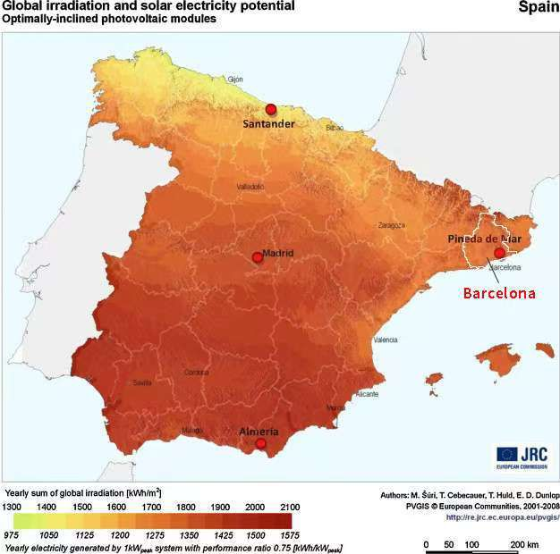
```
<p style="font-size: 0.6em; text-align: center; margin-top: 0;">
Figure 1: Spain Solar Irradiation (Adapted from:  <a href="https://www.sciencedirect.com/science/article/pii/S1364032111002620">Sumper et.al.(2011)</a>)
</p>
]
.pull-right-narrow[

- Located in northeast Spain, benefiting from a Mediterranean climate

- High solar irradiation of around 1,500–1,700 kWh/m²/year

- Average solar radiation of around 4.12-4.56 kWh/m²/day, offering excellent conditions for rooftop PV installation

- Highest solar resource cities in Europe, favourable for solar energy generation year-round
]
<p style="font-size: 0.6em; text-align: left; margin-top: 0;">
Source: <a href="https://pvgis.com/en/blog/solar-energy-spain-guide-installers"> PVGIS (2024)</a>, <a href="https://www.mdpi.com/2071-1050/9/2/247"> Jiménez-Torres (2017)</a> 
</p>

---
# Barcelona
### High Solar Potential, Low Energy Self-sufficiency
.pull-left-wide[
- **Potential**: 7.9M m² suitable roof area, where flat and slightly inclined terraces account for 67% of total roof surface; Generation potential of 1,191 GWh/year, around 60% of domestic electricity demand

- **Low realisation**: City produces just **1%** of its own energy, only **5%** of households have solar installations

- **Core Issue**: Barcelona has potential but the rooftops are under utilised for the city 
]
.pull-right-narrow[
```{r, echo=FALSE, out.width='100%', fig.align='center'}
# Add picture
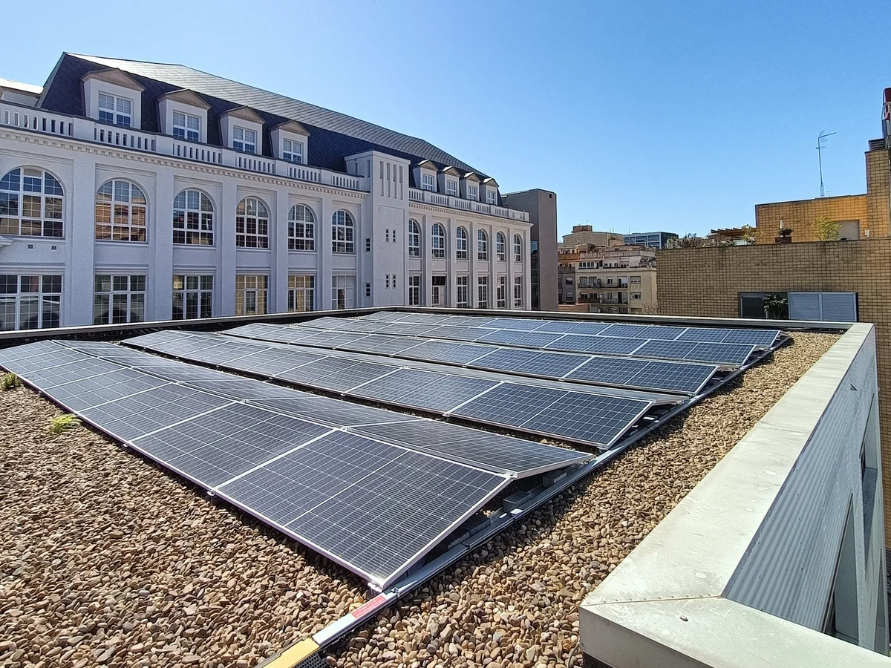
```
<p style="font-size: 0.6em; text-align: center; margin-top: 0;">
Figure 2: Solar Panels (Source: <a href="https://www.theguardian.com/world/2022/jul/24/barcelona-school-residents-create-solar-energy-community">the Guardian (2022)</a>)
</p>
]

.clearfix[]
<div style="background: #722f37; color: white; padding: 10px 16px; border-radius: 6px; font-size: 0.9em;">
  Barcelona has the rooftop capacity for solar expansion, but current uptake remains far below that potential.
</div>

<p style="font-size: 0.6em; text-align: left; margin-top: 0;">
Source: <a href="https://www.energia.barcelona/en/generate-energy/generar-energia/map-how-much-energy-can-you-generate">Energia Barcelona(n.d.)</a>, <a href="https://netzerocities.app/resource-4178">Ajuntament de Barcelon(2024)</a> 
</p>

---
# Policy Goals and Agenda
.panelset[
.panel[.panel-name[Global Agenda]

.pull-left-3[
```{r, echo=FALSE, out.width='100%', fig.align='right'}
# Add picture
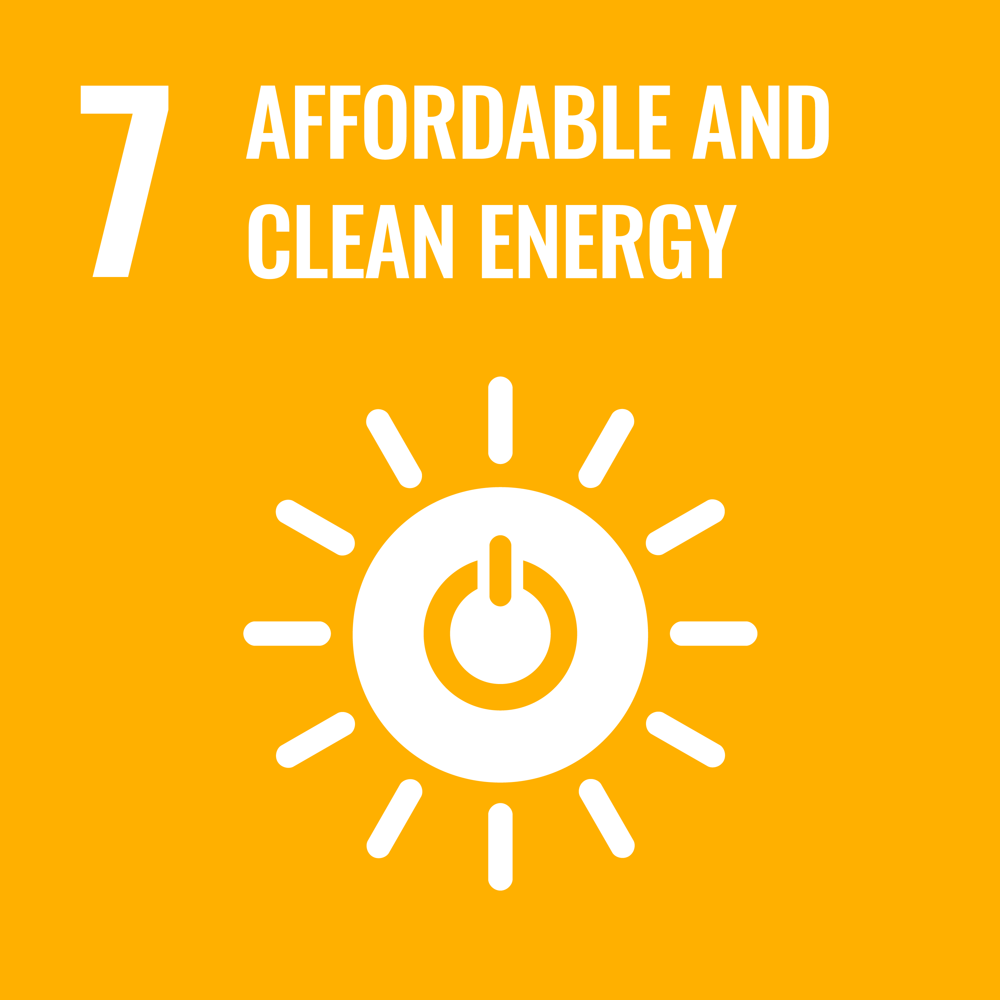
```
<p style="font-size: 0.6em; text-align: center; margin-top: 0;">
Figure 4: SDG 7: increases access to affordable, reliable and clean energy; Source: <a href="https://www.un.org/sustainabledevelopment/news/communications-material/">United Nations(2024)</a>
</p>
]
.pull-middle-3[
```{r, echo=FALSE, out.width='100%', fig.align='right'}
# Add picture
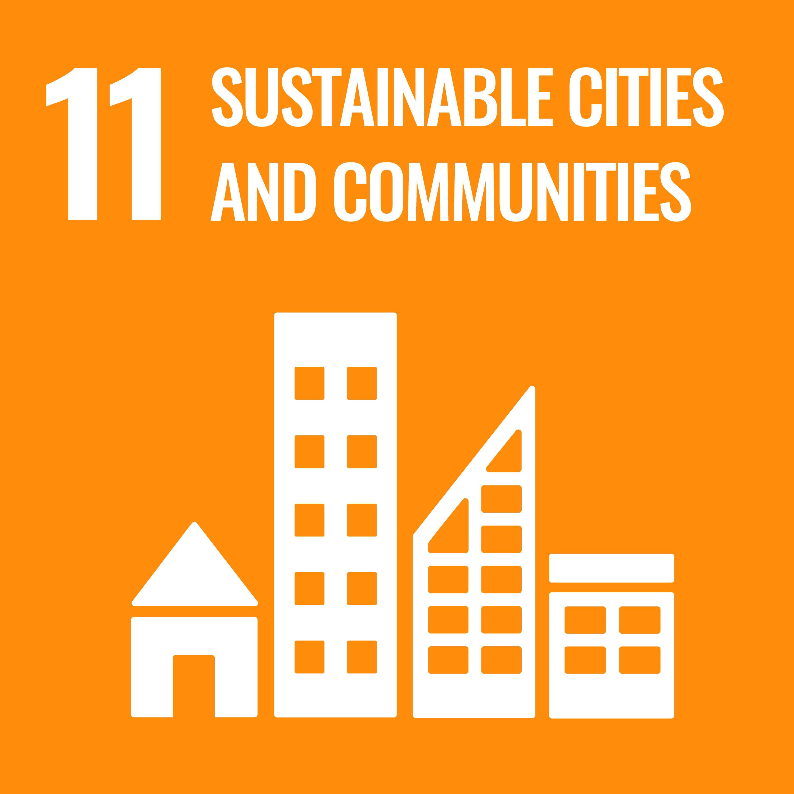
```
<p style="font-size: 0.6em; text-align: center; margin-top: 0;">
Figure 5: SDG 11: supports a more sustainable and resilient urban system; Source: <a href="https://www.un.org/sustainabledevelopment/news/communications-material/">United Nations(2024)</a>
</p>
]
.pull-right-3[
```{r, echo=FALSE, out.width='100%', fig.align='right'}
# Add picture

```
<p style="font-size: 0.6em; text-align: center; margin-top: 0;">
Figure 6: SDG 13: reduces emissions and strengthens climate action in the built environment; Source: <a href="https://www.un.org/sustainabledevelopment/news/communications-material/">United Nations(2024)</a>
</p>
]
]
.panel[.panel-name[EU Policy]
- **The European Green Deal, Renewable Energy Directive**
  - Binding target of 42.5% renewable energy across the EU by 2030
  
- **EU Solar Energy Strategy**
  - Target of 600 GW of solar PV capacity across the EU by 2030
  
- **Renovation Wave Strategy**
  - Target to renovate 35 million buildings by 2030 (including improving energy performance)

<p style="font-size: 0.6em; text-align: left; margin-top: 0;">
Source: <a href="https://energy.ec.europa.eu/topics/renewable-energy/renewable-energy-directive-targets-and-rules/renewable-energy-directive_en">Energy(2023)</a>, <a href="https://energy.ec.europa.eu/topics/energy-efficiency/energy-performance-buildings/renovation-wave_en#:~:text=Renovating%20both%20public%20and%20private,to%20regional%20and%20local%20actors 
">Energy(2020)</a>, <a href="https://energy.ec.europa.eu/topics/energy-efficiency/energy-performance-buildings/renovation-wave_en#:~:text=Renovating%20both%20public%20and%20private,to%20regional%20and%20local%20actors 
">European Parliament(2024)</a>
</p>

]

.panel[.panel-name[National Policy]
- Integrated National Energy and Climate Plan (NECP) 2023-2030

  - Targets 81 % renewable energy in electricity generation and 48 % renewables on final energy use by 2030
  
  - Installation of 76 GW of photovoltaics (with 19 GW for self-consumption) by 2030
  
  - Lower household energy expenditure to 5.7% by 2030

<p style="font-size: 0.6em; text-align: left; margin-top: 0;">
Source: <a href="https://www.miteco.gob.es/es/prensa/ultimas-noticias/2024/septiembre/el-gobierno-aprueba-la-actualizacion-del-plan-nacional-integrado.html">Ministerio para la Transición Ecológica y el Reto Demográfico. (2023)</a>
</p>
]

.panel[.panel-name[Municipal Policy]
.pull-left-wide[
**Barcelona Climate Plan 2018-2030**
.pull-left-3[
```{r, echo=FALSE, out.width='100%', fig.align='right'}
# Add picture
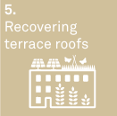
```
<p style="font-size: 0.4em; text-align: center; margin-top: 0;">
Figure 7:Line of Action 5, recover terrace roofs and increase PV generation; Source: <a href="https://www.barcelona.cat/barcelona-pel-clima/sites/default/files/climate_plan_maig.pdf">Ajuntament de Barcelona(2018)</a>
</p>
]
.pull-middle-3[
```{r, echo=FALSE, out.width='100%', fig.align='right'}
# Add picture
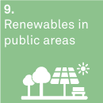
```
<p style="font-size: 0.4em; text-align: center; margin-top: 0;">
Figure 8: Line of Action 9, renewables in public space and municipal installation; Source: <a href="https://www.barcelona.cat/barcelona-pel-clima/sites/default/files/climate_plan_maig.pdf">Ajuntament de Barcelona(2018)</a>
</p>
]
.pull-right-3[
```{r, echo=FALSE, out.width='100%', fig.align='right'}
# Add picture
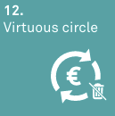
```
<p style="font-size: 0.4em; text-align: center; margin-top: 0;">
Figure 9: Line of Action 12,green jobs, self-employment and climate-related economic transition; Source: <a href="https://www.barcelona.cat/barcelona-pel-clima/sites/default/files/climate_plan_maig.pdf">Ajuntament de Barcelona(2018)</a>
</p>
]
]
.pull-right-narrow[
**Strategy for Energy Transition**: increase renewable electricity generation by 10% and PV capacity fivefold, promote and financially support installations

**Tax Incentives**: up to 50% IBI on property, 95% ICIO on construction and installation and 50% IAE on business tax reduction for solar installations

<p style="font-size: 0.4em; text-align: left; margin-top: 0;">
Source: <a href="https://ajuntament.barcelona.cat/ecologiaurbana/en/what-we-do-and-why/energy-and-climate-change/strategy-energy-transition">Ajuntament de Barcelona(n.d.)</a>, <a href="https://www.barcelona.cat/barcelona-pel-clima/en/pla-clima/pla-transicio-energetica">Barcelona for Climate(2025)</a>, <a href="https://www.energia.barcelona/en/generate-energy/generate-energy/grants-and-allowances">Barcelona Energia(n.d.)</a>
</p>
]
]
]

---
# Key Problems and Issues

Despite strong policy frameworks, the situation remains concerning...

- Renewable energy generation remains underdeveloped at both local and regional scale
- Current installations are concentrated in public and municipal buildings
- Ageing housing stock; 81% of properties have a low energy performance rating (E, F, or G)
- Energy poverty persists, energy bills exceed 10% of household income for many households
- Renewable transition is slow; energy system still relies on centralised, non-renewable sources
- A major Iberian power outage exposed the fragility of Spain's centralised energy system in April 2025, underlining the urgency of strengthening energy sources and distributed solar installation

<div style="background: #722f37; color: white; padding: 10px 16px; border-radius: 6px; font-size: 0.9em; margin-top: 1em;">
The key challenges Barcelona faces are an ageing building stock, uneven solar installation, and energy vulnerability, highlighting the need for targeted implementation. 
</div>

<p style="font-size: 0.6em; text-align: left; margin-top: 0.5em;">
Sources: <a href="https://ajuntament.barcelona.cat/barcelonallibres/en/noticia/ageing-housing-with-poor-energy-efficiency-but-a-huge-potential-for-improvement-1188771">Ajuntament de Barcelona (n.d.)</a>, <a href="https://bcnroc.ajuntament.barcelona.cat/jspui/bitstream/11703/134731/2/Climate%20City%20Contracte%20of%20Barcelona%20%28Annexes%29.pdf">Ajuntament de Barcelona(n.d.)</a>, <a href="https://www.energia.barcelona/en/generate-energy/generar-energia/map-how-much-energy-can-you-generate">Barcelona Energia(n.d.)</a>, <a href="https://ajuntament.barcelona.cat/barcelonallibres/en/noticia/ageing-housing-with-poor-energy-efficiency-but-a-huge-potential-for-improvement-1188771">Ajuntament de Barcelona(n.d.)</a>
</p>
---
class: inverse, center, middle
# What is missing from policy?
### Barcelona has a strong policy commitment, but lack of a city-scale operational system to identify where rooftop solar should be prioritised to maximum social, economic, and environmental benefit!

.clearfix[]

<div style="background: #2c5f2e; color: white; padding: 10px 16px; border-radius: 6px; font-size: 0.9em;">
Therefore, we aim to address this implementation gap using Earth Observation to improve identification and prioritisation of rooftop solar installation across Barcelona.
</div>

---
class: inverse, center, middle
## What is missing from the operational system?
### Analysis of Barcelona’s Current Solar Dashboard

--
Do you want to know how much energy you can generate in your home? 

Search for your building and discover its energy potential:


???
ICY:  

YESSSSS, We have the vision, and we have the political will. But here’s the problem: WITHOUT a visualization system, we’re flying blind.  

Do you want to know how much energy you can generate in your home?    

That is exactly the question Barcelona’s official portal answers today.    

BUT, let’s bring a critical eye to this:  


---

```{css, echo=FALSE}
/* 7-3 ratio */
.left-70 { width: 63%; float: left; }
.right-30 { width: 34%; float: right; }

/* slider panel */
.scroll-box {
  height: 400px;
  overflow-y: auto;
  padding: 6px;
  border-left: 1px solid #802222;
}
/* Markdown in div */
.scroll-box ul { display: block; }
```

## Analysis of Barcelona’s Current Solar Dashboard


.left-70[
### .center[Dashboard Overview]


.footnote[Source: [Barcelona Energia Mapa](https://www.energia.barcelona/ca/generar-energia/generar-energia/mapa-quanta-energia-podeu-generar)]
]

.right-30[
### .center[Key Metrics]

.scroll-box[
#### ☀️ SOlar Resource Potential
- **Incident Solar Radiation Radiation:** Qualitative rating  ***(e.g., "Very Good")***

- **Solar Irradiated Surface Area:** Total roof area ($m^2$)

#### ⚡ Electric Performance Data
- **Usable Area:** Net area
- **Capacity:** Peak power ($kW$)
- **Generation:** $kWh/year$
- **Coverage:** $>100\%$ needs

#### 🌍 Environmental Impact
- **GHG Savings:** $kgCO_2eq/year$

#### 💰 Economic Assessment
- **Investment:** CapEx (€)
- **Maintenance:** €/year
- **Financial Savings:** €/year
]
]


???
ICY:   

Take a look at the screen—this is the current Barcelona Energy Mapping. If you’re a resident and you want to see if your roof is 'solar-ready,' you type in your address, and you get this dashboard.  


It breaks down into four main buckets:  

The Solar Resource: Is my roof 'Very Good' or just 'Okay'?  

The electric Performance: How many Energy will I get?  estimated value     

The Environment: how much you’ll save On carbon footprint reduction. OF course estimated   

The Economics: What is my Capacity and my yearly savings?   Also estimated  

 

Basically, You search your building, you see a number, and you feel the **potential**

It looks comprehensive, right? Well... not quite.    

Its potential estimation is based on 2D data that doesn't see the real world.  

(Here is an advanced question: where the government should prioritize investment on?)

 
???
# Analysis of Barcelona’s Current Solar Dashboard

### 1. *Resource Potential*

  --**Incident Solar Radiation:** Currently provided as a qualitative rating (e.g., "Very Good"). 

  --**Solar Irradiated Surface Area:** The total roof area receiving effective sunlight ($m^2$) 

### 2. *Performance Data*

 --**Effective Usable Area:** Net rooftop area available for PV installation after general setbacks. 

 --**Installable Capacity:** Potential peak power output measured in $kW$. 

 --**Annual Energy Generation:** Estimated yearly electricity production in $kWh/year$ 

 --**Common Area Consumption Coverage:** Indicates that the generation covers more than $100\%$ of the building's shared areas' energy needs. 

### 3. *Environmental Impact* 

 --**GHG Emissions Savings:** Measured in $kgCO_2eq/year$ to align with SDG 13 (Climate Action). 

### 4. *Economic Assessment* 

 --**Estimated Investment Cost:** Initial capital expenditure ($€$) for the installation. 

 --**Estimated Maintenance Cost:** Yearly operational expenses ($€/year$) 

 --**Estimated Financial Savings:** Annual reduction in electricity bills ($€/year$). 

---
class: inverse, center, middle
# Research Question: 4 GAPs

--
### 1 The "Static" Gap: 
Current data dashboard provides a 'snapshot' of theoretical potential but cannot monitor the actual progress of solar installations in real-time. 

(Without knowing what is already "on the roof," the city cannot track its progress toward Global Development Goals (e.g., SDG 7).) 
--

### 2 The "Precision" Gap: 
Small obstacles (chimneys, HVAC) are often ignored, leading to a 20% overestimation of usable area. (resulting in unrealistic financial expectations for citizens and flawed energy planning for the city.) 
--

---
class: inverse, center, middle
# Research Question: 4 GAPs
--

### 3 The "Integration" Gap:  
The dashboard does not place Barcelona in a broader background context (e.g., comparable spatial and policy indicators).
--

### 4 The "Future" Gap:
The dashboard provides limited support for understanding future development potential.

---
# Our Solution

1. Use remote sensing data to reduce the cost and turnaround time of data updates.
2. Use Machine Learning methods to better understand the current solar panel distribution.
3. Fit Barcelona into a broader policy context by providing additional policy-relevant layers.
4. Add more ways to calculate and prioritise the huge potential rooftop area.


---
class: reverse, center, middle
# Dashboard Redesign   
## How can we improve the operational system?


--

### 1. Static---Dynamic  

--

### 2. Theoretical---Practical  

--

### 3. Isolated---Intergrated  
 
???
ICY:  

So, we’ve identified the gaps, and we’ve built the technical solution. But what does that actually look like in practice?  How do we take a 2D map and turn it into a 3D strategy?  
 
We’ve redesigned the operational system based on three fundamental shifts:    

First: From Static to Dynamic.  (We don't just guess what's there; we see the current PV distribution in real-time.)   

Second: From Theoretical to Practical. (We aren't giving you a 'theoretical' number; we are giving you the Net Potential Expansion Area—the high-fidelity truth of what can actually be built. )  

Third: From Isolated to Integrated. (we transform this from an isolated energy map into an integrated decision tool that identifies where solar can actually solve social and economic problems.)  

Yan: work flow:  "While Barcelona’s current dashboard relies on static geometric estimations (e.g., gross rooftop area), our Smart Plugin integrates VHR (Very High Resolution) imagery and LiDAR point clouds. By deploying Deep Learning segmentation, we verify 'true availability' by filtering out micro-obstacles (HVAC, chimneys) and existing PV panels, thereby providing a high-fidelity mapping of the Net Potential Expansion Area."


---
# Workflow
```{r, echo=FALSE, out.width='100%', fig.align='center'}
# Add picture
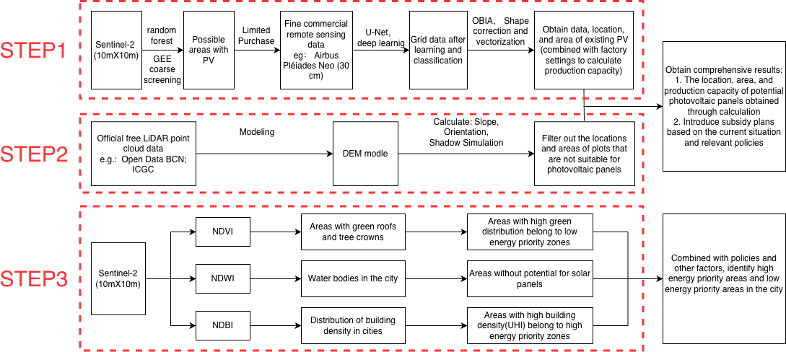
```
<p style="font-size: 0.6em; text-align: center; margin-top: 0;">
Figure 10: Model Workflow
</p>

---
# Methodology - Step 1.1: U-net

### **1. Symmetric Encoder-Decoder Structure**: 

<ul>
  <li><b>Contracting Path (Encoder)</b>: Captures multi-scale spectral and geometric features of PV panels through deep feature extraction.
  
  <li><b>Extensive Path (Decoder)</b>: Recovers feature maps to original spatial resolution, enabling centimeter-level precision in localization.
</ul>

### **2. Cross-Scale Skip Connections**
        
### **3. Robustness in Complex Urban Environments**

### **4. End-to-End High-Efficiency Mapping**

---
# Methodology - Step 1.1: U-net
```{r, echo=FALSE, out.width='100%', fig.align='center'}
# Add picture
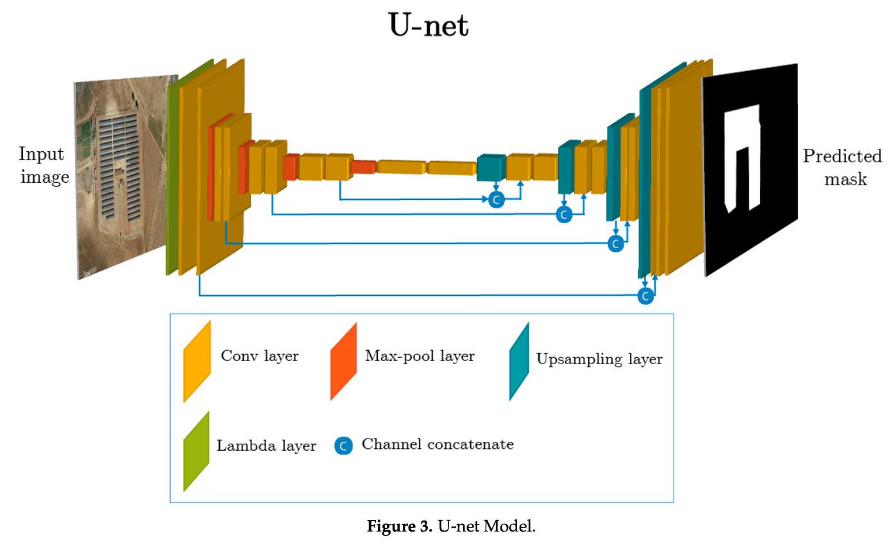
```
<p style="font-size: 0.6em; text-align: center; margin-top: 0;">
Figure 11: Results of U-net model (Source: <a href="https://www.mdpi.com/2076-3417/11/14/6524"> Pérez-González et.al.,(2021) </a>) 
</p>
---
# Methodology - Step 1.1: U-net
```{r, echo=FALSE, out.width='100%', fig.align='center'}
# Add picture
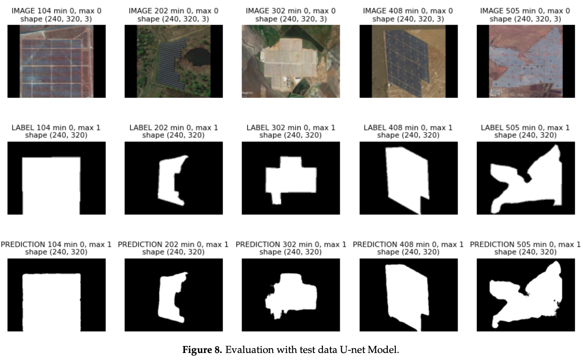
```
<p style="font-size: 0.6em; text-align: center; margin-top: 0;">
Figure 12: Results of U-net model (Source: <a href="https://www.mdpi.com/2076-3417/11/14/6524"> Pérez-González et.al.,(2021) </a>) 
</p>

---
# Methodology - Step 1.2: OBIA
**1. Multiresolution Segmentation** 
  - Aggregates spectrally similar pixels into geographically meaningful objects to mitigate "salt-and-pepper" noise.
        
**2. Geometric Constraints**
  - Leverages physical attributes—including aspect ratio, rectangularity, and area—to filter out non-PV entities (e.g., circular water tanks).
        
**3. Spectral-Spatial Integration**
  - Evaluates object regularity alongside spectral signatures to significantly reduce false-positive rates.
        
**4. Vectorized Output** 
  - Facilitates the direct export of GIS-compliant polygonal boundaries, streamlining precise surface area calculations.

---
# Methodology- Step 1.2: OBIA

.pull-left[
```{r, echo=FALSE, out.width='100%', fig.align='center'}
# Add picture
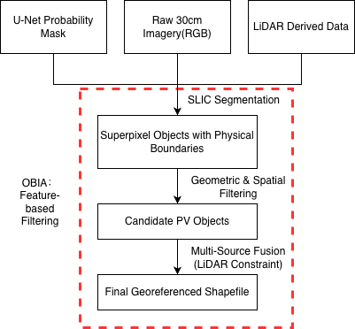
```
<p style="font-size: 0.6em; text-align: center; margin-top: 0;">
Figure 13: Workflow of OBIA model
</p>]

.pull-right[
```{r, echo=FALSE, out.width='100%', fig.align='center'}
# Add picture
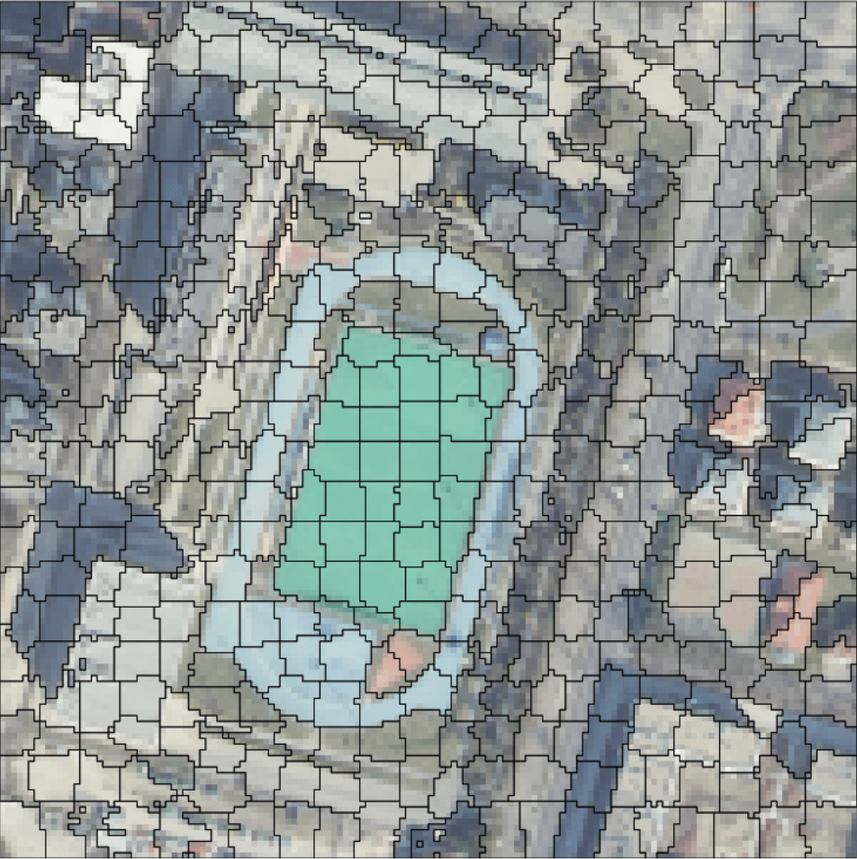
```
<p style="font-size: 0.6em; text-align: center; margin-top: 0;">
Figure 14: Result of SLIC (Source: <a href="https://jakubnowosad.com/ogh2021/#10"> Ladisa et.al.,(2022) </a>)
</p>]

---
# Methodology - Step2: Data
<div style="height: 30px;"></div> 
```{r, echo=FALSE, out.width='90%', fig.align='center'}
# Add picture
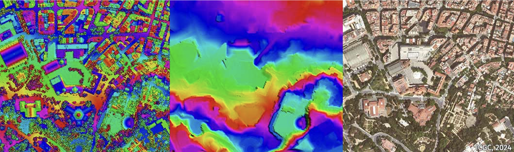
```
<p style="font-size: 0.6em; text-align: center; margin-top: 0;">
Figure15: Models (DSM and DTM) from ICGC  (Source: 
  <a href=https://www.icgc.cat/en/Geoinformation-and-Maps/Data-and-products/Elevations/Territorial-elevations/Territorial-LiDAR> Institut Cartogràfic i Geològic de Catalunya (ICGC) </a>)
</p>

---
# Methodology - Step2: Lidar Workflow
```{r, echo=FALSE, out.width='90%', fig.align='center'}
# Add picture
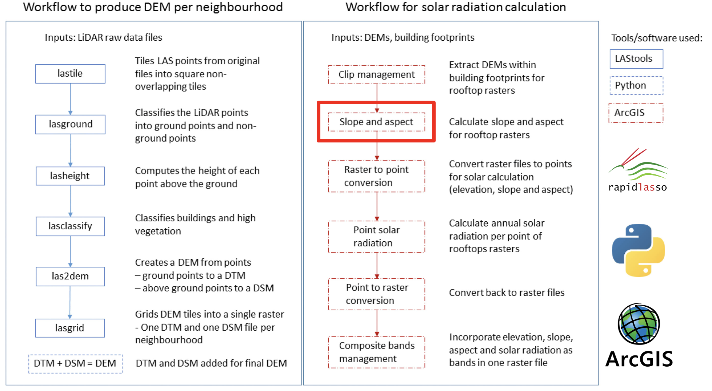
```
<p style="font-size: 0.6em; text-align: center; margin-top: 0;">
Figure15: LiDAR Workflow (Source: <a href="https://www.sciencedirect.com/science/article/abs/pii/S0960148117303324"> Suomalainen et.al.,(2017) </a>)
</p>

---
# Methodology- Step 2.1: slop

```{r, echo=FALSE, out.width='90%', fig.align='center'}
# Add picture
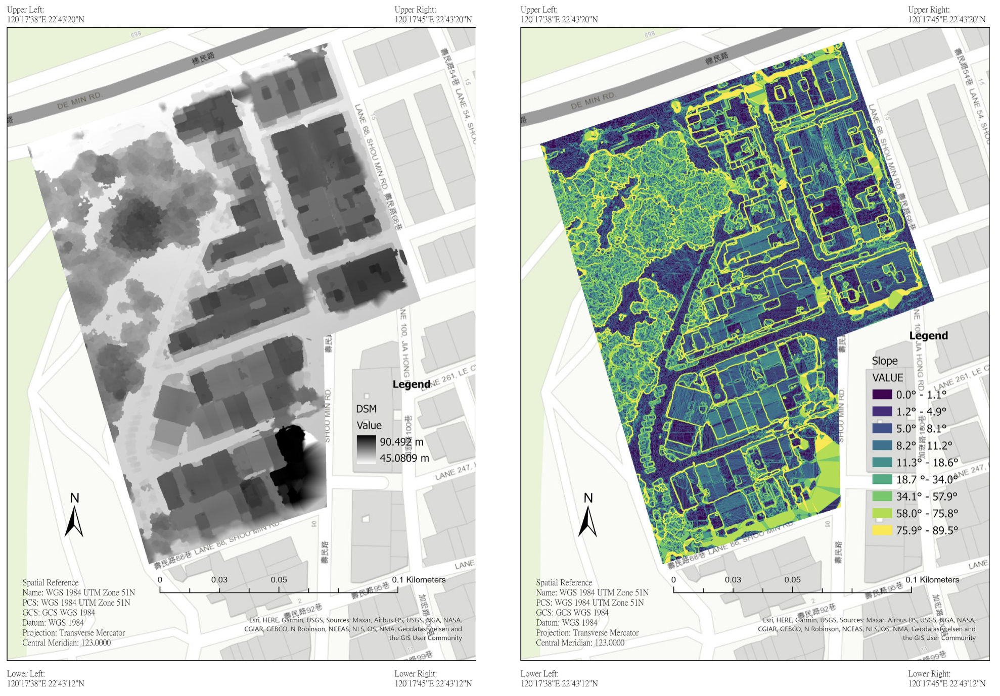
```
<p style="font-size: 0.6em; text-align: center; margin-top: 0;">
Figure16: Calculate the slope (in degrees)  (Source: <a href="https://www.sciencedirect.com/science/article/abs/pii/S0960148117303324"> Suomalainen et.al.,(2017) </a>)
</p>

---
# Methodology - Step2: Lidar Workflow
```{r, echo=FALSE, out.width='90%', fig.align='center'}
# Add picture
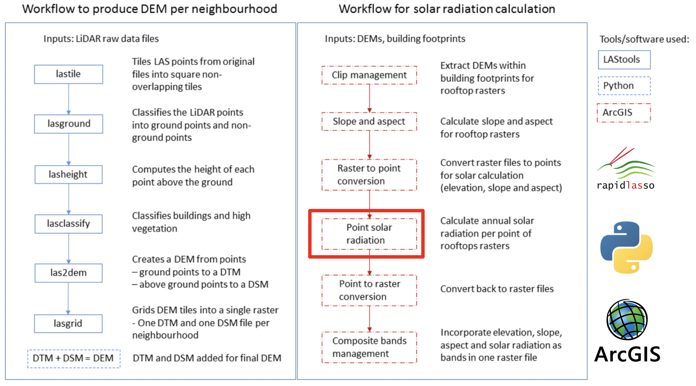
```
<p style="font-size: 0.6em; text-align: center; margin-top: 0;">
Figure15: LiDAR Workflow (Source: <a href="https://www.sciencedirect.com/science/article/abs/pii/S0960148117303324"> Suomalainen et.al.,(2017) </a>)
</p>

---
# Methodology -Step2.2: Solar Radiation
```{r, echo=FALSE, out.width='90%', fig.align='center'}
# Add picture
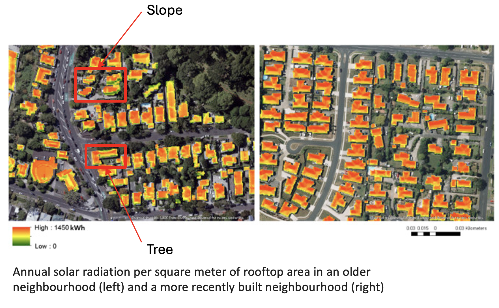
```
<p style="font-size: 0.6em; text-align: center; margin-top: 0;">
Figure17: LiDAR Solar Detection (Source: <a href="https://ars.els-cdn.com/content/image/1-s2.0-S0960148117303324-gr7.jpg"> Els-cdn.com. (2017) </a>)
</p>


---

<div style="height: 30px;"></div> 

```{r, echo=FALSE, out.width='100%', fig.align='center'}

# Add picture
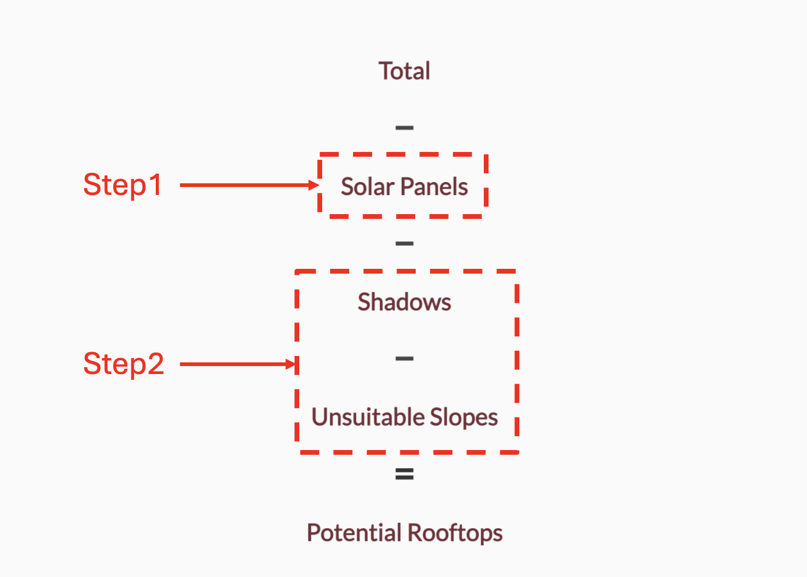
```

---
# Methodology - Step 3: Multispectral Indices
*Assessing Urban Resilience and Environmental Context using Sentinel-2*

.panelset[
.panel[.panel-name[🌿 NDVI (Vegetation)]
**Definition:** The Normalized Difference Vegetation Index quantifies vegetation health and density by measuring the difference between near-infrared (which vegetation strongly reflects) and red light.  
**Formula:** $NDVI = \frac{NIR - Red}{NIR + Red}$

**Purpose in Project:** Identifies existing green roofs and street-level tree canopies. It helps exclude tree-shaded areas from PV potential and flags vegetation-poor neighborhoods (low NDVI) as high-priority zones for **"Biosolar" (PV + Green Roof) subsidies** to mitigate heat risk.

**Literature Support:** [Weng et al. (2004)](https://doi.org/10.1016/j.rse.2003.11.005) demonstrated a strong negative correlation between NDVI and Land Surface Temperature (LST), validating NDVI as a crucial metric for mapping urban heat vulnerability.
]

.panel[.panel-name[💧 NDWI (Water)]
**Definition:** The Normalized Difference Water Index enhances water features while eliminating soil and terrestrial vegetation features.  
**Formula:** $NDWI = \frac{Green - NIR}{Green + NIR}$

**Purpose in Project:** Acts as a strict **spatial mask**. Barcelona is a coastal city; NDWI automatically delineates the Mediterranean Sea, inland water bodies, and large rooftop swimming pools, ensuring these flat surfaces are not falsely identified as viable solar potential areas by the algorithms.

**Literature Support:** [McFeeters (1996)](https://doi.org/10.1080/01431169608948714) introduced NDWI to successfully delineate open water features and suppress non-water noise in urban and environmental remote sensing.
]

.panel[.panel-name[🏗️ NDBI (Built-up)]
**Definition:** The Normalized Difference Built-up Index highlights urban areas of barren soil, concrete, and asphalt, which reflect shortwave infrared (SWIR) stronger than NIR.  
**Formula:** $NDBI = \frac{SWIR - NIR}{SWIR + NIR}$

**Purpose in Project:** Maps the density of the built environment (e.g., the Eixample district). High NDBI strongly correlates with **severe Urban Heat Islands (UHI)**. Overlapping high NDBI with our "Solar Gap" allows the city to target rooftop PV as a physical shading mechanism to cool down the most exposed concrete blocks.

**Literature Support:** [Guo et al. (2015)](https://doi.org/10.1016/j.landurbplan.2014.11.007) explored the quantitative relationship between urban biophysical composition and heat, proving that NDBI is the primary driver of increased Land Surface Temperature in dense urban clusters.
]
]

---
class: inverse, center, middle
# NEW!!! Dashboard Show Time

???
ICY:  
All these complex algorithms are just the engine.   What we really need is the Steering Wheel.      
We need a way to see all this data working together to make real decisions.   
So, we took all those methodologies and we fused them into one single, powerful interface.  

```{css, echo=FALSE}
/* 7:3 */
.left-70 { width: 63%; float: left; }
.right-30 { width: 34%; float: right; }

/* SLIDER */
.scroll-box-dl {
  height: 450px;
  overflow-y: auto;
  padding: 10px;
  border-left: 1px solid #802222;
  background: rgba(128, 34, 34, 0.03);
}

/* PIXEL */
.img-container-dl {
  width: 100%;
  height: 340px;
  background: #f0f0f0;
  display: flex;
  align-items: center;
  justify-content: center;
  overflow: hidden;
  border-radius: 4px;
  border: 1px solid #ddd;
}

.img-container-dl img { transition: transform 0.3s ease; }

/* BUTTON */
.nav-btns-dl {
  display: flex;
  justify-content: center;
  gap: 8px;
  margin-top: 10px;
  flex-wrap: wrap;
}

.nav-btns-dl button {
  font-size: 11px;
  padding: 5px 10px;
  cursor: pointer;
  border: 1px solid #802222;
  background: white;
  border-radius: 4px;
}

.active-dl { background: #802222 !important; color: white; }

/* FOLDER */
.dl-details {
  background: white;
  padding: 8px;
  margin-bottom: 8px;
  border-radius: 4px;
  border: 1px solid #eee;
  font-size: 0.8em;
}
.dl-details summary { font-weight: bold; cursor: pointer; color: #802222; }
```

---

## Step 1: Deep Learning Existing Asset Detection

.left-70[
### .center[DL Segmentation Layers]

<div class="img-container-dl">
  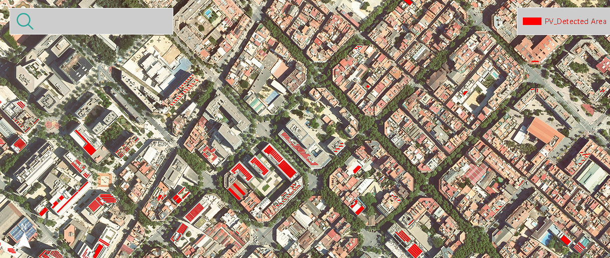
</div>

<div class="nav-btns-dl">
  <button class="active-dl" onclick="swapDL('images/01StatusLayerML.png', 'Layer 1: Input High Resolution Image', this)">01. Input</button>
  <button onclick="swapDL('images/02StatusLayerMLOutcome.png', 'Layer 2: DL Segmentation', this)">02. Outcome</button>
  <button onclick="swapDL('images/023StatusLayerMLOutcome.png', 'Layer 3: Final Detection- Results of U-net/OBIA', this)">03. Final</button>
</div>

<div class="nav-btns-dl" style="margin-top:10px;">
  <button onclick="zoomDL(1.2)">🔍 Zoom In</button>
  <button onclick="zoomDL(0.8)">🔍 Zoom Out</button>
  <button onclick="resetDL()">🔄 Reset</button>
</div>

<p id="dl-caption" style="text-align:center; font-size:0.8em; color:#802222; margin-top:5px; font-weight:bold;">Current: Layer 1: Input Status</p>
]

.right-30[
### .center[Key Metrics]

.scroll-box-dl[

<details open class="dl-details">
<summary>🔍 Asset Detection</summary>

- Existing PV Area: PV Area Detected($m^2$)  

<br>

- Data Source: VHR Satellite Imagery

<br>

- Input Resolution: 0.3m per pixel

<br>

- Last Updated: 2024-09-20  

</details>


<details class="dl-details">
<summary>⚡ Capacity Info</summary>

- Installed Capacity: 500 kW   

<br>

- Generation: 1,200 kWh/year

<br>

- Coverage:> 100% needs

</details>

<details class="dl-details">
<summary>🛠️ Model Config</summary>

- CNN: ResNet-50 / Swin-T


</details>

]
]

<script>
let dlScale = 1;
const dlImg = document.getElementById('dl-display');
const dlCap = document.getElementById('dl-caption');

function swapDL(path, text, btn) {
  dlImg.src = path;
  dlCap.innerText = "Current: " + text;
  resetDL();
  document.querySelectorAll('.nav-btns-dl button').forEach(b => b.classList.remove('active-dl'));
  btn.classList.add('active-dl');
}

function zoomDL(f) {
  dlScale *= f;
  dlImg.style.transform = "scale(" + dlScale + ")";
}

function resetDL() {
  dlScale = 1;
  dlImg.style.transform = "scale(1)";
}
</script>

<div style="clear: both;"></div>


???

First, remember that 'Static Gap' we talked about? Here is the fix.  

[(Our Step 1 uses that U-Net and OBIA workflow to scan the city in real-time. We aren't just looking at roofs; )  
By identifying every single existing solar panel across Barcelona’s skyline, we establish a **high-precision** Baseline.  
To unlock the city's true growth potential, we must first quantify how much PV is already on the roof--- To **reveal the real gap** for expansion.]  

On the left, you can see our DL Segmentation Layers.  

We are processing VHR (Very High Resolution) Satellite Imagery at 0.3m per pixel resolution. You can toggle between the raw input and our model's outcome to see how the AI highlights existing solar panels in red with HIgh precision.  

But it’s not just a pretty map; it’s a data-driven engine. We’ve updated the system with three critical variable groups:  

Real-Time Asset Detection: 

Actual Capacity Info: current energy baseline   

Model Configuration: using backbones handle feature extraction: shadows or dark rooftops  (high-fidelity detection that is robust against the 'visual traps' of the complex urban environment.)

ResNet-50 (Residual Network):
Swin-T (Swin Transformer - Tiny):
We chose ResNet-50 or Swin-T to balance inference speed and accuracy.
---

```{css, echo=FALSE}
/*  7-3 */
.left-70 { width: 63%; float: left; }
.right-30 { width: 34%; float: right; }

/* SLIDER - LiDAR */
.scroll-box-lidar {
  height: 450px;
  overflow-y: auto;
  padding: 10px;
  border-left: 1px solid #2980b9;
  background: rgba(41, 128, 185, 0.03);
}

/* PIXEL */
.img-container-lidar {
  width: 100%;
  height: 340px;
  background: #f0f0f0;
  display: flex;
  align-items: center;
  justify-content: center;
  overflow: hidden;
  border-radius: 4px;
  border: 1px solid #ddd;
}

/* BUTTON */
.nav-btns-lidar {
  display: grid;
  grid-template-columns: repeat(3, 1fr);
  gap: 5px;
  margin-top: 10px;
}

.nav-btns-lidar button {
  font-size: 11px;
  padding: 5px;
  cursor: pointer;
  border: 1px solid #2980b9;
  background: white;
  border-radius: 4px;
}

.active-lidar { background: #2980b9 !important; color: white; }

/* FOLDER */
.lidar-details {
  background: white;
  padding: 8px;
  margin-bottom: 8px;
  border-radius: 4px;
  border: 1px solid #eee;
  font-size: 0.8em;
}
.lidar-details summary { font-weight: bold; cursor: pointer; color: #2980b9; }
```

## Step 2: LiDAR Precision Refinement

.left-70[
### .center[3D Geometric Analysis]

<div class="img-container-lidar">
  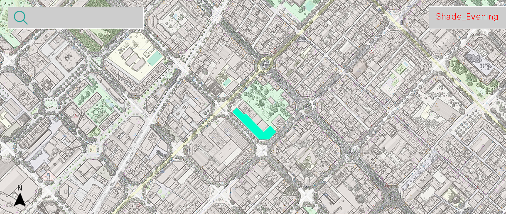
</div>

<div class="nav-btns-lidar">
  <button onclick="swapL('images/03ShadeMor.png', 'Morning Shade', this)">🌅 Morning</button>
  <button onclick="swapL('images/031Shadenoon.png', 'Noon Shade', this)">☀️ Noon</button>
  <button class="active-lidar" onclick="swapL('images/032Shadeeve.png', 'Evening Shade', this)">🌆 Evening</button>
  <button onclick="swapL('images/04Slope.png', 'Slope Analysis', this)">📐 Slope</button>
  <button onclick="swapL('images/05Aspect.png', 'Aspect/Orientation', this)">🧭 Aspect</button>
  <button onclick="swapL('images/06Elevation.png', 'Elevation', this)">⛰️ Elevation</button>
</div>

<p id="lidar-caption" style="text-align:center; font-size:0.8em; color:#2980b9; margin-top:5px; font-weight:bold;">Current: 032Shadeeve.png</p>
]

.right-30[
### .center[Key Metrics]

.scroll-box-lidar[

<details open class="lidar-details">
  <summary>📐 LiDAR Analysis</summary>
  - Average_Tilt: $13.5^\circ$
  
<br>
  
  - Azimuth: $155^\circ$ (180°=South) 
  
<br>

  - Shadows: Dynamic ray-tracing for 3D shadow casting.
  
<br> 
  
  - Detection obstacles: 10cm+ vertical rooftop appurtenances.  

  
<details class="lidar-details">
  <summary>☀️ Effective Potential</summary>

  - Solar Hours:  10h (0-24)
   
<br>
  
  - Obstacle Ratio: 0.36 (0.00-1.00) 
  
<br>
  
  - Net Area: 12 $m^2$  

</details>

]
]

<script>
function swapL(path, name, btn) {
  document.getElementById('lidar-display').src = path;
  document.getElementById('lidar-caption').innerText = "Layer: " + path.split('/').pop();
  document.querySelectorAll('.nav-btns-lidar button').forEach(b => b.classList.remove('active-lidar'));
  btn.classList.add('active-lidar');
}
</script>

<div style="clear: both;"></div>

???
ICY:  
Now, even with the best AI, a 2D image is still just a flat surface.
Step 2 gives us the 'How much, exactly and where they can actually fit'  

We focus on four key dimensions:
shade
slope
aspect
elevation

Using LiDAR, our Ray-tracing filters out shadows and identifies Slope to subtract 3D obstacles like chimneys/HVAC UNITS.   

Specifically, Notice the Aspect: because of Barcelona’s unique Superblock grid, in this context, solar panels are perfectly aligned—either North-South or orthogonal to the streets.  


[Shade: Through Dynamic Ray-tracing, we simulate shadows from sunrise to sunset. This tells us exactly which roofs are blocked by taller buildings or trees, filtering out 'low-value' surfaces.

Slope: It identifies if a roof is flat or pitched, and more importantly, it helps our algorithm detect and subtract 3D obstacles like chimneys or AC units to find the Net Usable Area.

Aspect:  Look at the pattern here. Because of Barcelona’s unique Superblock (Cerdà Grid) layout, rooftop orientations are remarkably regular. Most panels are either aligned North-South or placed orthogonal to the street grid, perfectly integrating solar technology with the city’s iconic urban landscape.

Elevation: This provides the vertical context, accounting for height differences that affect solar exposure and the 'Urban Canyon' effect.]


---

```{css, echo=FALSE}
/*  7-3  */
.left-70 { width: 63%; float: left; }
.right-30 { width: 34%; float: right; }

/* SLIDER - API */
.scroll-box-api {
  height: 450px;
  overflow-y: auto;
  padding: 10px;
  border-left: 1px solid #27ae60;
  background: rgba(39, 174, 96, 0.03);
}

/* PIXEL */
.img-container-api {
  width: 100%;
  height: 340px;
  background: #f0f0f0;
  display: flex;
  align-items: center;
  justify-content: center;
  overflow: hidden;
  border-radius: 4px;
  border: 1px solid #ddd;
}

/* BUTTON */
.nav-btns-api {
  display: grid;
  grid-template-columns: repeat(4, 1fr);
  gap: 5px;
  margin-top: 10px;
}

.nav-btns-api button {
  font-size: 10px;
  padding: 5px;
  cursor: pointer;
  border: 1px solid #27ae60;
  background: white;
  border-radius: 4px;
}

.active-api { background: #27ae60 !important; color: white; }

/* FOLDER */
.api-details {
  background: white;
  padding: 8px;
  margin-bottom: 8px;
  border-radius: 4px;
  border: 1px solid #eee;
  font-size: 0.8em;
}
.api-details summary { font-weight: bold; cursor: pointer; color: #27ae60; }
```

## Step 3: Syn API & Spectral Analysis

.left-70[
### .center[Multispectral Index & Land Use]

<div class="img-container-api">
  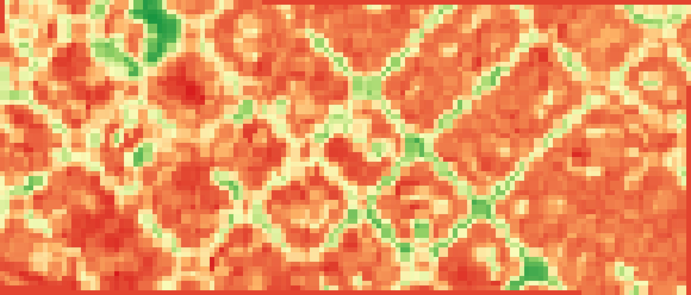
</div>

<div class="nav-btns-api">
  <button class="active-api" onclick="swapAPI('images/ndvi2024.jpeg', 'NDVI (Vegetation Index)', this)">🌿 NDVI</button>
  <button onclick="swapAPI('images/ndbi2024.jpeg', 'NDBI (Built-up Index)', this)">🏗️ NDBI</button>
  <button onclick="swapAPI('images/ndwi2024.jpeg', 'NDWI (Water Index)', this)">💧 NDWI</button>
  <button onclick="swapAPI('images/001LandUse.png', 'Land Use Classification', this)">🗺️ Land Use</button>
</div>

<p id="api-caption" style="text-align:center; font-size:0.8em; color:#27ae60; margin-top:5px; font-weight:bold;">Current: Layer: NDVI (Vegetation Index)</p>
]

.right-30[
### .center[Key Fields]

.scroll-box-api[

<details open class="api-details">
  <summary>🛰️ Spectral Reflectance</summary>
  - NDVI: Identifies green roof potential.
<br> 

  - NDBI: Distinguishes roof materials vs. soil.
<br> 

  - NDWI: Detects ponding or water features.
</details>

<details class="api-details">
  <summary>🏠 Context</summary>
  - Roof_Material: Concrete, metal, or tile.
<br>
  - Land_Use_Class: Residential, Industrial, or Municipal classification.
</details>

<details class="api-details">
  <summary>🏛️ Regulatory Constraints</summary>
  - Heritage_Status: 0/1 (Restricted zones)
<br>
  - Data_Confidence: API cross-validation score
</details>

]
]

<script>
function swapAPI(path, name, btn) {
  document.getElementById('api-display').src = path;
  document.getElementById('api-caption').innerText = "Layer: " + name;
  document.querySelectorAll('.nav-btns-api button').forEach(b => b.classList.remove('active-api'));
  btn.classList.add('active-api');
}
</script>

<div style="clear: both;"></div>


---
## Smart Solar Analytical Engine 


```{css, echo=FALSE}
/*  7-3  */
.left-70 { width: 63%; float: left; }
.right-30 { width: 34%; float: right; }

/* SLIDER */
.summary-scroll {
  height: 500px;
  overflow-y: auto;
  padding: 5px;
  border-left: 2px solid #2c3e50;
}

.summary-details {
  background: #f8f9fa;
  padding: 8px;
  margin-bottom: 8px;
  border-radius: 4px;
  border: 1px solid #eee;
  font-size: 0.75em;
}

.summary-details summary {
  font-weight: bold;
  cursor: pointer;
  color: #2c3e50;
  list-style: none;
}

.summary-details summary::-webkit-details-marker { display: none; }

.summary-details[open] { background: #fff; border-left: 4px solid #e67e22; }

.field-tag {
  color: #e67e22;
  font-weight: bold;
  font-family: monospace;
}
```

.left-70[
### .center[Integrated Solar Potential Map]

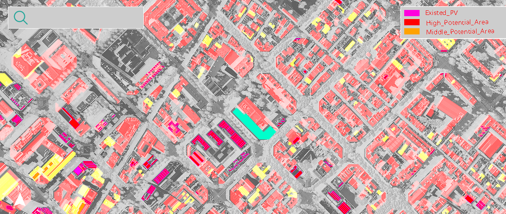

.footnote[**Integration:** Fusion of RS, LiDAR, and Municipal API datasets.]
]

.right-30[
### .center[Data Schema]

.summary-scroll[

<details open class="summary-details">
  <summary>🆔 Metadata</summary>
  - <span class="field-tag">Building_ID:</span> Municipal cadastre link.
<br>
  - <span class="field-tag">Global_ID:</span> Spanish national parcel code.
<br>
  - <span class="field-tag">Confidence:</span> RS reliability (0.0-1.0).
</details>

<details class="summary-details">
  <summary>📏 Detection</summary>
  - <span class="field-tag">PV_Area_Detected:</span> Current panels ($m^2$).
  <br>
  - <span class="field-tag">Effective_Potential:</span> Net gap ($m^2$).
  <br>
  - <span class="field-tag">Obstacle_Ratio:</span> LiDAR point cloud filter.
</details>

<details class="summary-details">
  <summary>📐 Attributes</summary>
  - <span class="field-tag">Average_Tilt:</span> Slope ($0.0-90.0^\circ$).
  <br>
  - <span class="field-tag">Azimuth:</span> Orientation ($0-359^\circ$).
  <br>
  - <span class="field-tag">Solar_Hours:</span> Ray-tracing (0-8,760h).
</details>

<details class="summary-details">
  <summary>⚖️ Assessmnet </summary>
  - <span class="field-tag">Solar_Gap_Score:</span> Ranking priority.
  <br>
  - <span class="field-tag">Social_Equity:</span> Income + Poverty data.
    <br>
  - <span class="field-tag"> CO2_Offset_Annual:</span> Estimated carbon reduction potential.
      <br>
  - <span class="field-tag">Economic_ROI:</span> Dynamic return on investment period.

</details>

<details class="summary-details">
  <summary>🧱  Context</summary>
  - <span class="field-tag">Roof_Material:</span> Spectral reflectance.
  <br>
  - <span class="field-tag">Heritage_Status:</span> Planning constraint.
  <br>
  - <span class="field-tag">Land_Use:</span> Million-AID classification.
</details>

<details class="summary-details">
  <summary>📈 Monitoring & Yield</summary>
  - <span class="field-tag">Self_Sufficiency:</span> IoT + RS fusion.
  <br>
  - <span class="field-tag">Current_Gen_kW:</span> Real-time output.
</details>

]
]

???
ICY:  
Now, let’s bring it all together. we’ve fused our Step 1 detection and Step 2 3D geometry into this Smart Solar Analytical Engine.   

On the left, It's a Conceptual image, our Integrated Solar Potential Map.   
it’s a high-fidelity fusion of Satellite imagery, LiDAR point clouds, and Municipal APIs. We’ve moved from the city's 'Static Gap' to a Dynamic Dashboard that recognizes existing assets and precisely calculates the Net Gap for every single rooftop in Barcelona.  

By treating our Step 3 context as a dynamic, stackable layer, we’ve solved the Future Gap, allowing the city to simulate growth and prioritize social equity. As you can see on the map, by layering this multi-source data —we can finally filter the noise and pinpoint exactly where High-Potential zones meet High-Priority needs.  

To make this operational for policy, we’ve structured our findings into a comprehensive Data Schema.  

Most importantly, we move to Assessment. By layering Solar Potential with Social Equity and Economic ROI, we finally answer the 'City’s Question': Where should we prioritize investment?  
Let’s look at the Formula that powers this prioritization.  

---
```{css, echo=FALSE}
/* local arrangemnt */
.formula-accordion { width: 100%; font-family: 'Arial', sans-serif; }

.formula-accordion details {
  margin-bottom: 12px;
  padding: 15px;
  border-radius: 10px;
  background: #ffffff;
  border: 1px solid #eee;
  transition: all 0.3s ease;
}

.formula-accordion summary {
  font-weight: bold;
  cursor: pointer;
  outline: none;
  font-size: 1.1em;
}

/* color bar */
.orange-panel { border-left: 8px solid #e67e22 !important; color: #e67e22; }
.green-panel  { border-left: 8px solid #27ae60 !important; color: #27ae60; }
.pink-panel   { border-left: 8px solid #e91e63 !important; color: #e91e63; }
.blue-panel   { border-left: 8px solid #2980b9 !important; color: #2980b9; }

/* bg */
.formula-accordion details[open] { background: #fcfcfc; box-shadow: 0 4px 10px rgba(0,0,0,0.05); }

/* overflow */
.formula-content {
  padding: 10px 0;
  color: #333; 
}
```


## Multiple Index Synthesis


.formula-accordion[

<details open class="orange-panel">

<summary>1. Precision: Net Solar Potential Gap ($E_{gap}$)</summary>
<div class="formula-content">
$$E_{gap} = [ (A_{roof} \times f_{obs}) - A_{exist} ] \times \left( \sum_{h=1}^{8760} G_{h} \times \text{Shade}_h \right) \times \eta_{sys} \times PR$$
</div>
</details>

<details class="green-panel"><summary>2. Climate: Carbon Gap Tracking ($\Delta CO_2$)</summary>

<div class="formula-content">
$$\Delta CO_2(t) = \text{Target}_{2030} - [ \sum (\text{Stock}_{detected} + \text{Potential}_{Egap}) \times EF_{grid} ]$$
</div>
</details>

<details class="pink-panel"><summary>3. Economy: Dynamic ROI ($T_{payback}$)</summary>

<div class="formula-content">

$$T_{payback} = \frac{Cost_{invest}}{\sum_{y=1}^{n} [ (Yield \times SSR \times P_{buy}) + (Yield \times (1-SSR) \times P_{sell}) - Cost_{maint} ]}$$
</div>
</details>

<details class="blue-panel"><summary>4. Equity: Social Equity Index ($SEI$)</summary>
<div class="formula-content">
$$SEI = \text{Norm}(Score_{gap}) \times \left( 1 - \frac{\text{District\_Income}}{\text{City\_Avg\_Income}} \right)$$
</div>
</details>]

.center[]


???
ICY:  
Finally, we translate our vision into a repeatable Mathematical Framework. To close the four GAPs, we’ve developed these four core synthesis formulas:  

From Static to Dynamic: We identify the True precise Net soalr Gap.  

From Theoretical to Practical: We turn 'potential' into Payback Period,  factoring in self-consumption rates and maintenance costs to prove financial feasibility to homeowners. Also,  We track the distance to Barcelona's 2030 targets in real-time, subtracting our detected stock from the city's carbon goals.    

From Isolated to Integrated: By weighting the solar gap against income levels, ensuring energy justice,  We layer Social Equity data to tell the city not just where the sun is, but where the Energy Poverty is.  


---
# Data Feasibility Analysis
*Evaluating the strengths and limitations of our Earth Observation data sources.*

### 🤖 Step 1: PV Mapping

**Main data source: Airbus Pléiades Neo (30 cm)**

**Advantage:** 30 cm RGB imagery plus infrared and Near Infrared (NIR) bands for PV vs. non-PV discrimination.

**Disadvantage:** Higher acquisition cost.

--

**Supplementary data source: Cartographic and Geological Institute of Catalonia (ICGC)**

**Advantage:** 25 cm RGB plus infrared imagery to improve classification detail and robustness.

**Disadvantage:** Does not provide NIR, so generalisation may require careful transfer learning.

---
# Data Feasibility Analysis
*Evaluating the strengths and limitations of our Earth Observation data sources.*

### ⛰️ Step 2: Potential Layers

**Main data source: ICGC LiDAR (Terrain & Shadows)**

**Advantage:** 
1. Very high resolution surface elevation (DEM/DSM) and robust derivation of slope and aspect.
2. Supports shadow modelling and incidence-geometry correction for solar potential calculations.

**Disadvantage (Assumption):** LiDAR-derived features may be insufficient alone for complex rooftop cases, so ML + rule-based corrections are needed for final obstacle handling and PV mapping.

---
# Data Feasibility Analysis
*Evaluating the strengths and limitations of our Earth Observation data sources.*

### 🌍 Step 3: Context & Indicators

**Main data source: Sentinel-2**

**Advantage:** 10 m imagery and derived indices (RGB, NDVI, NDBI, NDWI) available since 2015.

**Disadvantage:** Limited spatial detail for rooftop-scale signatures; cloud availability issues.

--

**Supplementary data source: Sentinel-3**

**Advantage:** Complementary thermal/heat-map style context at low cost (useful for broader environmental interpretation).

**Disadvantage:** Coarser resolution; used for city-scale context rather than rooftop-level detection.

---
class: inverse, center, middle
# Project General Plan
---
# Budget (£500,000 total)

<div style="height: 30px;"></div> 

```{r, echo=FALSE, out.width='100%', fig.align='center'}

# Add picture
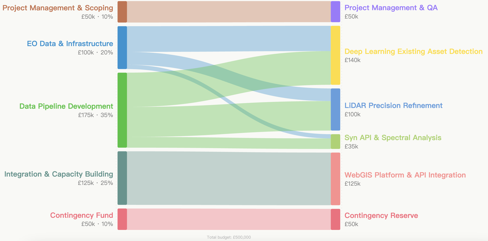
```
<p style="font-size: 0.6em; text-align: center; margin-top: 0;">
Figure 18: Sankey Diagram of Project Budget Allocation


---
# Other Purchases or Preparations
- Compute resources for training/inference (GPU/cloud) and data preprocessing (mosaicking, orthorectification).
- Ground-truth validation and annotation effort for PV vs. non-PV rooftop cases (to calibrate confidence scoring).
- GIS/workflow tooling for converting EO outputs into policy-ready vector/raster layers and API inputs.

---
# Project Timeline

```{r, echo=FALSE, out.width='100%', fig.align='center'}
# Add picture
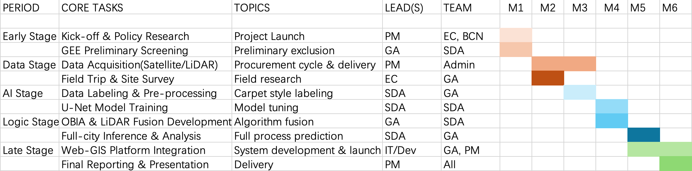
```
<p style="font-size: 0.6em; text-align: center; margin-top: 0;">
Figure19: Timeline
</p>

PM: Project Manager

GA: Geospatial Analyst

SDA: Senior Data Analyst

EC: Environmental Consultant

BCN: Barcelona City Council

IT/Dev: Web Developer

---
# Risk, Ethics and Limitations
.panelset[
.panel[.panel-name[Risks and Ethics]
.pull-left[
**Risks**
- Budget Constraints and Cost Exceedance
- Data Accuracy and Uncertainty
- Technical and Implementation Barriers
- Policy, Regulatory and Institutional Barriers
- Timeline Sensitivity
]
.pull-right[
**Ethics**
- Transparency and Accountability
- Data Usage, Consent and Privacy
- Social Equity Considerations
- Safety Standards and Professional Responsibility
]
]

.panel[.panel-name[Limitations]
- Identified potential does not reflect economic or market viability
  - Rooftops identified suitable for solar installation are based on size, shading, orientation, and location but does not reflect any financial considerations.
  - Costs for installation, grid connection, and prevailing market conditions remain outside the scope.

- Structural Stability and Load-Bearing Capacity
  - Structural integrity of existing building roofs is sufficient to withstand the additional weight and wind loads imposed by solar panels and their mounting structures were not assessed
  - A rooftop identified as suitable by the dashboard may still be rejected upon physical inspection. 
  - Actual installation would require integration with structural engineering assessments and consultation with qualified professionals.

<p style="font-size: 0.6em; text-align: left; margin-top: 0;">
References: <a href="https://www.energy.gov/eere/solar/solar-rooftop-potential"> Energy.gov. (n.d.)</a>
</p>

]
]
---
class: inverse, center, middle
# Thank you !